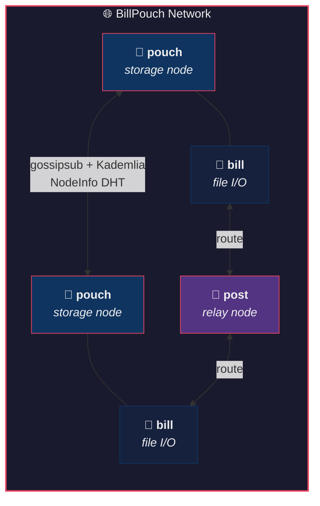
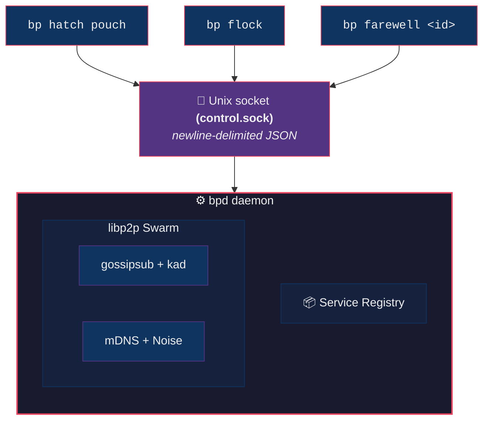
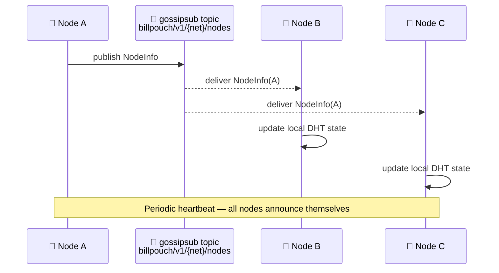

<div align="center">

```
      ___  _ _ _ ____                  _
     | __ )(_) | |  _ \ ___  _   _  ___| |__
     |  _ \| | | | |_) / _ \| | | |/ __| '_ \
     | |_) | | | |  __/ (_) | |_| | (__| | | |
     |____/|_|_|_|_|   \___/ \__,_|\___|_| |_|
```

**A P2P social distributed filesystem — written in Rust.** 

[](https://github.com/Onheiron/BillPouch/actions/workflows/ci.yml)
[](https://github.com/Onheiron/BillPouch/actions/workflows/smoke.yml)
[](https://github.com/Onheiron/BillPouch/actions/workflows/security.yml)
[](https://github.com/Onheiron/BillPouch/actions/workflows/coverage.yml)
[](https://onheiron.github.io/BillPouch/)
[](https://github.com/Onheiron/BillPouch/releases)
[](LICENSE)
[](https://www.rust-lang.org/)
[](https://libp2p.io/)
[]()

</div>

---

## The Pelican Metaphor

BillPouch takes its name and architecture from the pelican — a bird that hunts, stores, and shares:

| Service | Symbol | Role |
|---------|--------|------|
| **`pouch`** | 🦤 The pouch (throat sac) | Bids a portion of **local storage** into the network |
| **`bill`** | 🦤 The bill (beak) | Personal **file I/O interface** — your window into files stored across the network |
| **`post`** | 🦤 The wings | Pure **routing / relay** node — contributes only CPU and RAM, no storage |

Every user joins the network by running at least one service. The network is social: storage is pooled across participants, each identified by an Ed25519 keypair.

---

## Features

- **Truly P2P** — no central server, no coordinator. Every node is equal.
- **Social storage** — users bid their own disk space; the network tracks who contributes what.
- **Gossip-based DHT** — peer info propagates via [gossipsub](https://docs.libp2p.io/concepts/pubsub/overview/); the state schema is intentionally extensible (open `metadata` map).
- **Kademlia DHT** — for peer discovery and future content addressing.
- **mDNS** — zero-config local network discovery out of the box.
- **Noise + Yamux** — all connections are encrypted and multiplexed.
- **Ed25519 identity** — your keypair is your identity. Multiple nodes can belong to the same user.
- **Modular API surface** — core logic is a pure Rust library; CLI is just the first adapter. REST and gRPC layers can be added without touching the core.
- **Multiple networks** — one daemon can join several independent networks simultaneously.

---

## Architecture



### Crate structure

```
BillPouch/
├── Cargo.toml                          # Cargo workspace
└── crates/
    ├── bp-core/                        # Core library (no I/O)
    │   └── src/
    │       ├── identity.rs             # Ed25519 keypair, export/import
    │       ├── service.rs              # ServiceType enum + registry
    │       ├── config.rs               # XDG-aware config paths
    │       ├── error.rs                # Unified BpError type
    │       ├── daemon.rs               # Tokio daemon orchestrator
    │       ├── invite.rs               # Invite token create/redeem
    │       ├── coding/
    │       │   ├── gf256.rs            # GF(2⁸) arithmetic
    │       │   ├── rlnc.rs             # RLNC encode/recode/decode
    │       │   └── params.rs           # Adaptive k/n from QoS + target Ph
    │       ├── storage/
    │       │   ├── mod.rs              # StorageManager — quota + FragmentIndex
    │       │   ├── fragment.rs         # Per-chunk fragment index
    │       │   ├── manifest.rs         # FileManifest + NetworkMetaKey
    │       │   ├── meta.rs             # PouchMeta (capacity, available bytes)
    │       │   ├── encryption.rs       # ChunkCipher — CEK encrypt/decrypt
    │       │   └── agreement.rs        # StorageOffer + Agreement store
    │       ├── network/
    │       │   ├── behaviour.rs        # Combined libp2p NetworkBehaviour
    │       │   ├── mod.rs              # Swarm loop + NetworkCommand channel
    │       │   ├── state.rs            # Gossip-based NodeInfo store
    │       │   ├── qos.rs              # Per-peer RTT + fault score tracking
    │       │   ├── quality_monitor.rs  # Ping + Proof-of-Storage loop
    │       │   ├── fragment_gossip.rs  # RemoteFragmentIndex announcements
    │       │   ├── bootstrap.rs        # Persistent Kademlia peer cache
    │       │   └── kad_store.rs        # Kademlia record persistence
    │       └── control/
    │           ├── protocol.rs         # JSON control protocol (CLI ↔ daemon)
    │           └── server.rs           # Unix socket control server
    ├── bp-cli/                         # `bp` binary
    │   └── src/
    │       ├── main.rs                 # clap CLI entry point
    │       ├── client.rs               # Unix socket control client
    │       └── commands/
    │           ├── auth.rs             # login / logout / export-identity / import-identity
    │           ├── hatch.rs            # hatch
    │           ├── flock.rs            # flock
    │           ├── farewell.rs         # farewell
    │           ├── join.rs             # join / leave
    │           ├── put.rs              # put (RLNC encode + distribute)
    │           ├── get.rs              # get (fetch + RLNC decode)
    │           └── invite.rs           # invite create / join
    └── bp-api/                         # REST API daemon (axum)
        └── src/
            └── main.rs                 # HTTP server + embedded dashboard
```

### IPC: CLI ↔ Daemon



---

## Getting Started

### Prerequisites

- [Rust](https://rustup.rs/) 1.75 or later (stable or nightly)

```bash
curl --proto '=https' --tlsv1.2 -sSf https://sh.rustup.rs | sh
```

### Build

```bash
git clone https://github.com/your-username/BillPouch.git
cd BillPouch
cargo build --release
# Binary is at ./target/release/bp
```

Or install directly:

```bash
cargo install --path crates/bp-cli
```

---

## Usage

### 1. Create your identity

```bash
bp login --alias "your-name"
```

This generates an Ed25519 keypair stored in `~/.local/share/billpouch/identity.key`.
Your **fingerprint** (first 8 bytes of SHA-256 of your public key) is your user ID across the network.

### 2. Start a service

```bash
# Bid 10 GiB of local storage into the "my-network" network
bp hatch pouch --network my-network --storage-bytes 10737418240

# Start a personal file I/O interface
bp hatch bill --network my-network

# Start a relay-only node (no storage required)
bp hatch post --network my-network
```

The first `hatch` command automatically starts the background daemon.
Each service gets a unique **service ID** (UUID) printed on startup.

### 3. Transfer files

```bash
# Store a file in the network (RLNC erasure-coded + CEK-encrypted)
bp put photo.jpg --network my-network
# → prints chunk_id: 7f3a1...

# Retrieve a file
bp get 7f3a1... --network my-network -o photo_recovered.jpg
```

Fragments are distributed automatically to remote Pouch nodes. Recovery works as long as any `k` of the `n` fragments are reachable.

### 4. Join an existing network

```bash
bp join my-friends-network
```

Subscribes to the gossipsub topic for that network. Peers announce themselves automatically.

### 5. Inspect the flock

```bash
bp flock
```

```
╔══════════════════════════════════════════════════════╗
║             🦤  BillPouch — Flock View               ║
╚══════════════════════════════════════════════════════╝

📋 Local Services  (2)
─────────────────────────────────────────────────────
   [ pouch]  a3f19c2b  │  net: my-network  │  status: running
   [  bill]  7d82e401  │  net: my-network  │  status: running

🌐 Joined Networks  (1)
─────────────────────────────────────────────────────
   my-network  │  4 known peer(s)

🐦 Known Peers  (4)
─────────────────────────────────────────────────────
   12D3KooWGjE │ a3f19c2b │  pouch │ net: my-network
   12D3KooWBxA │ 7c1ea902 │   bill │ net: my-network
   ...
```

### 6. Invite a friend to your network

```bash
# Create an invite token (password-protected)
bp invite create --network my-network --password secret
# → prints a base64 token

# On the other machine:
bp invite join <token> --password secret
```

### 7. Move your identity to another machine

```bash
# Export
bp export-identity --out identity-backup.json

# On the new machine:
bp import-identity identity-backup.json
```

### 8. Stop a service

```bash
bp farewell a3f19c2b-e9d2-4f1a-bc30-112233445566
```

### 9. Log out

```bash
bp logout
```

Removes your identity key from disk. **This is irreversible** — back up with `bp export-identity` first.

---

## The NodeInfo Protocol



Every node periodically broadcasts a `NodeInfo` message on the gossipsub topic `billpouch/v1/{network_id}/nodes`. The schema is **intentionally open** — the `metadata` field allows future extensions without breaking existing nodes:

```json
{
  "peer_id": "12D3KooWGjE...",
  "user_fingerprint": "a3f19c2b",
  "user_alias": "carlo",
  "service_type": "pouch",
  "service_id": "550e8400-e29b-41d4-...",
  "network_id": "my-network",
  "listen_addrs": ["/ip4/192.168.1.10/tcp/54321"],
  "announced_at": 1710000000,
  "metadata": {
    "storage_bytes": 10737418240,
    "free_bytes": 8000000000,
    "version": "0.1.0"
  }
}
```

---

## Status — v0.2.1 Alpha

| Feature | Status |
|---|---|
| Ed25519 identity (login/logout/export/import) | ✅ Done |
| P2P gossip (gossipsub + Kademlia + mDNS) | ✅ Done |
| Multi-network support | ✅ Done |
| Storage marketplace (offer/accept/agreements) | ✅ Done |
| RLNC erasure coding (GF(2⁸), encode/recode/decode) | ✅ Done |
| CEK encryption (ChaCha20-Poly1305, per-user key) | ✅ Done |
| Adaptive k/n from live peer QoS | ✅ Done |
| File transfer: `bp put` / `bp get` | ✅ Done |
| Fragment distribution to remote Pouch nodes | ✅ Done |
| Proof-of-Storage challenge loop | ✅ Done |
| FragmentIndex gossip (targeted GetFile) | ✅ Done |
| NAT traversal (AutoNAT + relay circuit v2) | ✅ Done |
| Invite system (signed+encrypted token) | ✅ Done |
| Encrypted identity key (Argon2id + ChaCha20) | ✅ Done |
| REST API + web dashboard (axum) | ✅ Done |
| FUSE filesystem mount | 🔮 Future |
| gRPC API | 🔮 Future |
| Mobile / WASM client | 🔮 Future |

See [`wiki/12-status-roadmap.md`](wiki/12-status-roadmap.md) for full details.

---

## Contributing

Contributions are very welcome. Please open an issue first to discuss what you'd like to change.

```bash
# Run tests
cargo test

# Check formatting
cargo fmt --check

# Lint
cargo clippy -- -D warnings
```

---

## License

Licensed under either of:

- **MIT license** ([LICENSE-MIT](LICENSE-MIT))
- **Apache License, Version 2.0** ([LICENSE-APACHE](LICENSE-APACHE))

at your option.

---

<div align="center">
<sub>Built with ❤️ and <a href="https://www.rust-lang.org/">Rust</a> · Powered by <a href="https://libp2p.io/">libp2p</a></sub>
</div>
