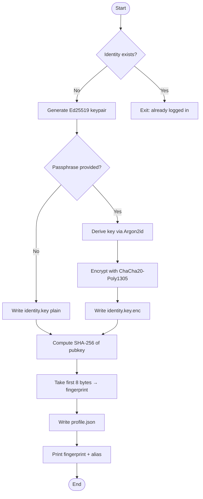
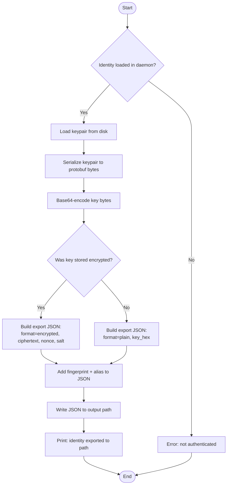
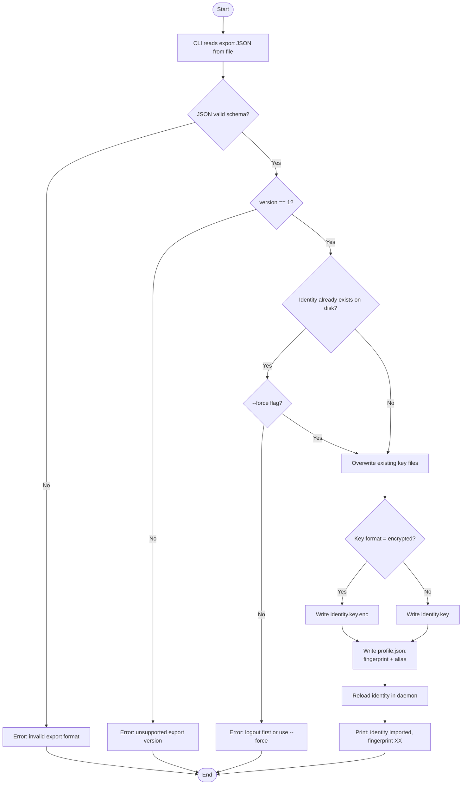
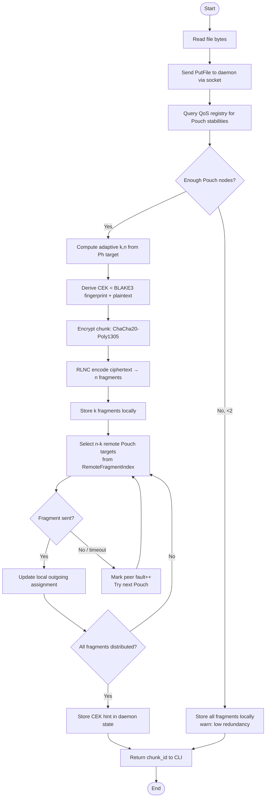
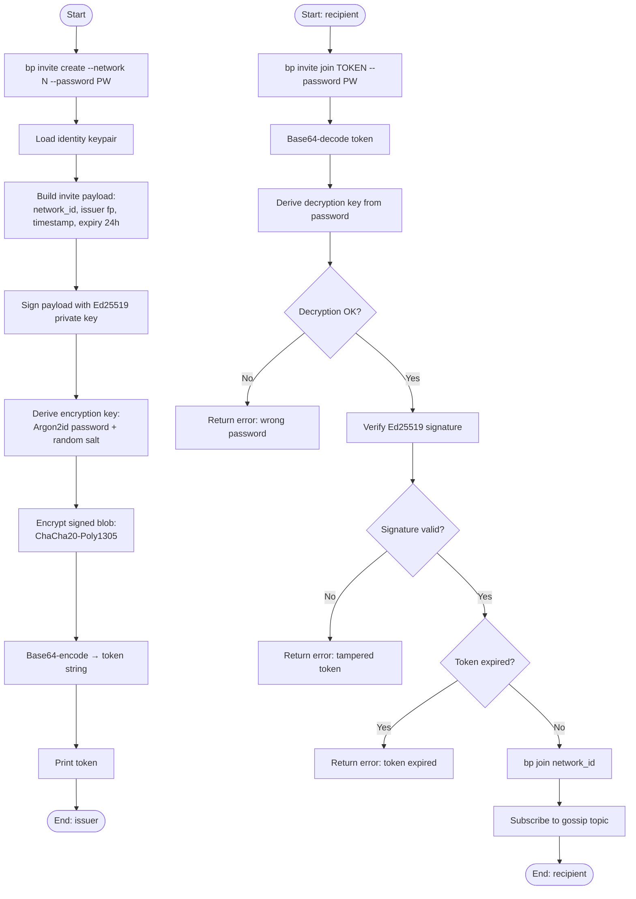
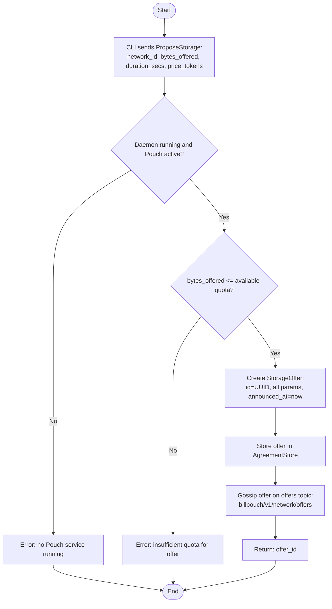
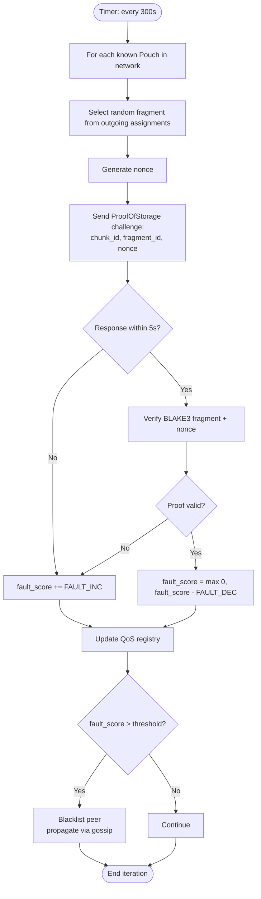
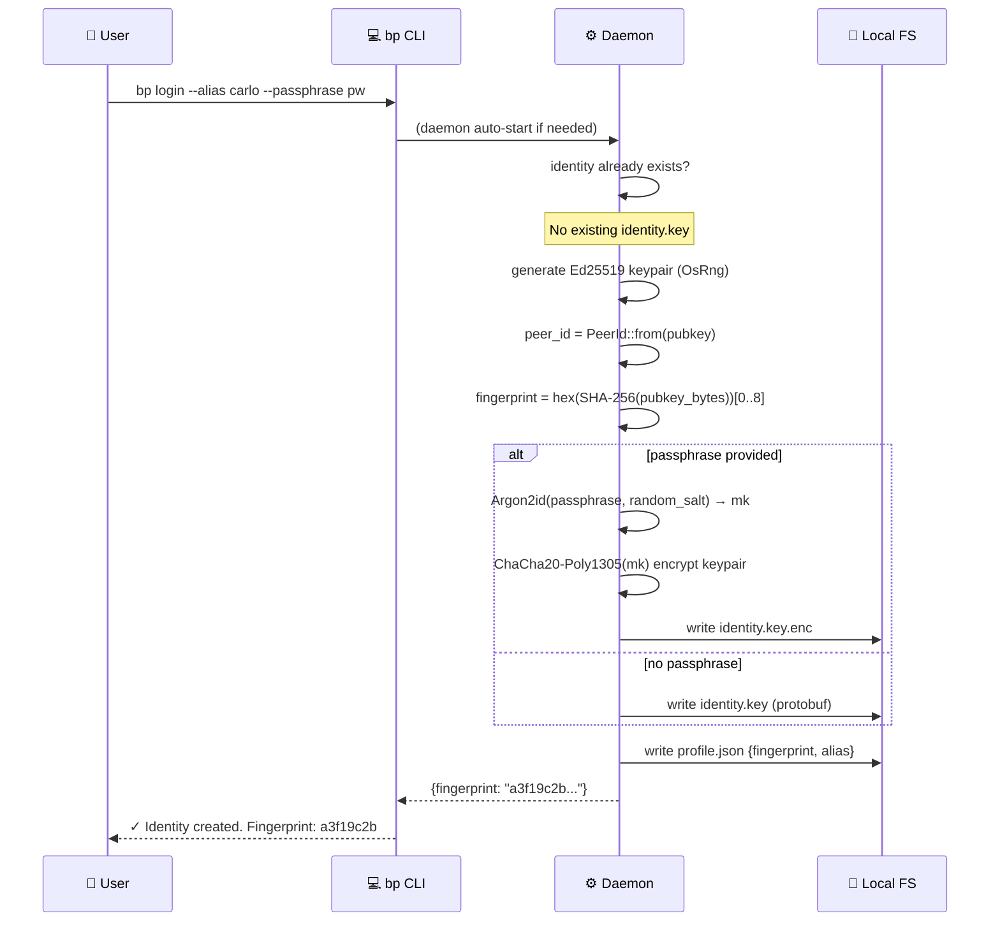
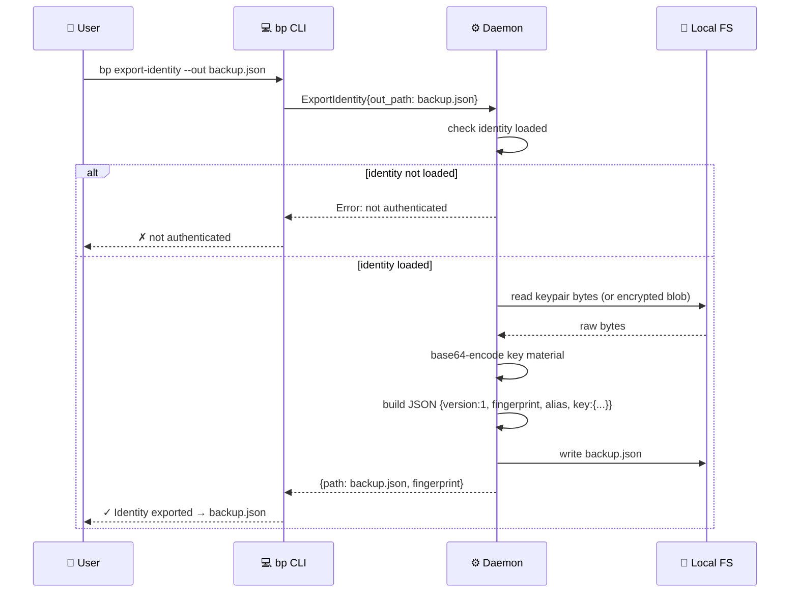

# BillPouch — Project Document

**Version:** 1.0 — March 2026  
**Status:** Alpha (v0.2.1)  
**Classification:** Internal / Investor-Facing

---

## Table of Contents

1. [Introduction](#1-introduction)
   - 1.1 [Abstract](#11-abstract)
   - 1.2 [State of the Art and Competitor Comparison](#12-state-of-the-art-and-competitor-comparison)
   - 1.3 [Features](#13-features)
2. [Functional Analysis](#2-functional-analysis)
   - 2.1 [Use Cases](#21-use-cases)
   - 2.2 [Use Flows](#22-use-flows)
   - 2.3 [Architecture](#23-architecture)
3. [Technical Analysis](#3-technical-analysis)
   - 3.1 [Entities and Relations](#31-entities-and-relations)
   - 3.2 [Interfaces](#32-interfaces)
   - 3.3 [Acceptance Tests](#33-acceptance-tests)
4. [Implementation](#4-implementation)
   - 4.1 [Tech Evaluation](#41-tech-evaluation)
   - 4.2 [Software Architecture](#42-software-architecture)
   - 4.3 [Tech Assessment](#43-tech-assessment)
5. [Future Implementations](#5-future-implementations)
   - 5.1 [Projection](#51-projection)
   - 5.2 [Additions](#52-additions)
   - 5.3 [Final Goal](#53-final-goal)

---

# 1. Introduction

## 1.1 Abstract

**The Problem**

Digital storage is broken. Today, individuals and organizations depend on a small set of cloud hyperscalers — Amazon S3, Google Drive, Dropbox, iCloud — to store their data. This creates systemic concentration risk, cost lock-in, and fundamental violations of data sovereignty. Users do not own their data; they rent access to it on proprietary infrastructure, subject to terms of service changes, price increases, account terminations, and government data requests. The total addressable market for cloud storage exceeded $100B in 2024 and is growing at 23% CAGR — yet the underlying model has not changed since 2006.

**The Opportunity**

Every connected device in the world has unused storage capacity. The average household contains 2–4 TB of spinning rust and SSD that sits 80% empty. BillPouch turns this idle resource into a participant in a sovereign, distributed storage network — without a central operator, without monthly subscriptions, and without single points of failure.

**The Solution**

BillPouch is a **P2P social distributed filesystem** written in Rust. It enables any group of trusted participants to pool their storage capacity into a resilient shared network. Storage is encrypted end-to-end, split into redundant fragments using Random Linear Network Coding (RLNC) over GF(2⁸), and distributed across Pouch nodes. Any `k` of `n` fragments suffice to recover a file — the system tolerates up to `n−k` node failures without data loss. The cryptographic identity of each participant is a locally-generated Ed25519 keypair: no registration, no server, no account.

**The Architecture**

The platform is built on three service types — a deliberate metaphor for the pelican:
- **Pouch** nodes contribute disk capacity and earn network reputation
- **Bill** nodes access the network for file storage and retrieval
- **Post** nodes contribute bandwidth and CPU as relay infrastructure

The protocol stack is fully open (libp2p), the codebase is open-source (MIT/Apache-2.0), and the core is a pure Rust library designed for embedding in any future frontend: mobile, WASM, CLI, or gRPC.

**The Ask**

BillPouch is currently at v0.2.1 Alpha with a working end-to-end file transfer pipeline, adaptive erasure coding, CEK encryption, Proof-of-Storage verification, and a storage marketplace protocol. We are seeking seed funding to accelerate the path to v1.0 production release, covering: security audit, FUSE filesystem integration, bootstrap network deployment, and go-to-market for the developer and prosumer segments.

---

## 1.2 State of the Art and Competitor Comparison

### Market Landscape

The distributed and decentralized storage space contains several distinct categories:

| Category | Players | Model |
|---|---|---|
| Centralized cloud | AWS S3, Google Cloud Storage, Azure Blob | Pay-per-GB, proprietary infrastructure |
| Consumer sync | Dropbox, OneDrive, iCloud, Google Drive | Freemium, siloed, vendor lock-in |
| Blockchain storage | Filecoin, Storj, Arweave, Sia | Token-incentivized, economic complexity |
| P2P/federated | IPFS, Tahoe-LAFS, Syncthing, Ceph | Technical, no integrated social layer |
| Enterprise NAS | MinIO, Ceph, GlusterFS | Self-hosted, operations-heavy |

### Direct Competitor Comparison

| Feature | BillPouch | IPFS | Filecoin | Storj | Syncthing |
|---|---|---|---|---|---|
| No central server | ✅ | ✅ | ✅ | ❌ Satellite nodes | ✅ |
| End-to-end encryption | ✅ CEK + ChaCha20 | ❌ | ❌ default | ✅ | ✅ |
| Erasure coding | ✅ RLNC adaptive | ❌ | ✅ Reed-Solomon | ✅ | ❌ |
| Social / trust model | ✅ Identity + networks | ❌ | ❌ token market | ❌ | ⚠️ share folders |
| Token/crypto required | ❌ | ❌ | ✅ FIL token | ✅ STORJ token | ❌ |
| Adaptive redundancy | ✅ live QoS-based | ❌ | ❌ fixed | ❌ fixed | ❌ |
| Multi-device identity | ✅ export/import | N/A | N/A | N/A | ⚠️ via config |
| Proof-of-Storage | ✅ BLAKE3 challenge | ❌ | ✅ | ✅ | ❌ |
| Invite / access control | ✅ signed token | ❌ | ❌ | ❌ | ⚠️ manual |
| Embedded REST/Web UI | ✅ | ⚠️ kubo | ❌ | ❌ | ❌ |
| Written in Rust | ✅ | ❌ Go | ❌ Go | ❌ Go | ❌ Go |
| Setup complexity | Low (single binary) | Medium | Very High | Medium | Low |

### Killer Features

1. **Social trust model** — storage is shared within named networks of trusted participants. No anonymous strangers, no economic speculation. The invite system with signed tokens enforces access control.

2. **Adaptive RLNC** — redundancy parameters `k` and `n` are computed live from the measured QoS of available Pouch nodes. If a peer is unreliable, the system automatically increases redundancy. No static configuration required.

3. **No tokens, no blockchain** — the system is governed by cryptographic identity and social trust. Participation is its own reward. This eliminates economic attack surfaces and regulatory friction.

4. **Proof-of-Storage without oracles** — BLAKE3-based storage challenges run automatically every 300 seconds. Cheating Pouch nodes accumulate fault scores and are evicted, without requiring an external oracle or smart contract.

5. **Pure Rust library core** — `bp-core` has zero direct I/O and is embeddable in any runtime: CLI, mobile, WASM, gRPC server. This is a technical moat against forks and competing implementations.

### Weaknesses

- **Alpha status** — not yet production-hardened; no FUSE mount; no NAT hole-punching beyond relay
- **No incentive layer** — free riders are possible; gamified reputation or token rewards are future work
- **Small network cold-start** — minimum viable network requires 3+ Pouch nodes; bootstrap infrastructure not yet deployed
- **No file deduplication** — each upload is independent; content-addressed deduplication is future work

---

## 1.3 Features

### Personas

**Alice — the Privacy-Conscious Developer**
- Has 2 TB of free NAS storage at home
- Wants to share photos and code backups with 3 trusted friends
- Values: zero cloud dependency, end-to-end encryption, no monthly fees
- Journey: `bp login` → `bp hatch pouch` → `bp invite create` → shares photos with `bp put`

**Bob — the Prosumer with Multiple Devices**
- Uses a laptop, a desktop, and a home server
- Wants to access his files from any device without cloud sync
- Values: multi-device identity, seamless access, data ownership
- Journey: `bp login` on all devices → `bp export-identity` for portability → `bp hatch bill` on laptop → `bp get` to retrieve files

**Carol — the Small Team Tech Lead**
- Manages a 6-person startup team
- Wants shared project storage without paying for S3 and without DevOps burden
- Values: easy onboarding (invites), reliability, audit trail
- Journey: sets up Pouch on VPS → `bp invite create` for each team member → team uses `bp put/get`

**Dave — the Node Operator**
- Owns a co-lo server with 10 TB available
- Wants to contribute bandwidth and storage to multiple networks
- Values: multiple network participation, low overhead, status visibility
- Journey: `bp hatch pouch --network net1` + `bp hatch post --network net2` + monitors via web dashboard

### Complete Feature List

#### Identity & Access
- Ed25519 keypair generation (`bp login`)
- Optional passphrase encryption (Argon2id + ChaCha20-Poly1305)
- Multi-device export/import (`bp export-identity`, `bp import-identity`)
- Signed + password-encrypted invite tokens (`bp invite create/join`)
- User fingerprint: 16-char hex, globally unique, immutable

#### Network Participation
- Three service roles: `pouch` (storage), `bill` (file I/O), `post` (relay)
- Multiple concurrent networks on a single daemon
- Gossip-based peer discovery (gossipsub + Kademlia + mDNS)
- Persistent Kademlia peer cache (`kad_peers.json`)
- Automatic stale peer eviction (120s silence threshold)

#### File Transfer
- `bp put <file>`: RLNC encode → CEK encrypt → distribute to remote Pouch nodes
- `bp get <chunk_id>`: fetch fragments → RLNC decode → CEK decrypt → write file
- Adaptive k/n selection from live peer QoS scores and target recovery probability Ph
- Remote fragment distribution via `/billpouch/fragment/1.1.0` request-response protocol
- Targeted fragment fetch using gossipped RemoteFragmentIndex

#### Storage & Reliability
- Per-Pouch storage quota with disk verification
- FragmentIndex gossip: all nodes track where each fragment lives
- Proof-of-Storage challenge every 300s (BLAKE3 challenge/response)
- Ping loop every 60s with RTT EWMA → latency score
- Fault score accumulation and peer blacklisting

#### Storage Marketplace
- Storage offer creation (`ProposeStorage`)
- Offer acceptance, agreement activation (`AcceptStorage`)
- Network-filtered offer/agreement listing

#### Developer Interface
- REST API via axum (`bp-api`)
- Embedded web dashboard (dark SPA, auto-refresh 5s)
- Unix socket JSON control protocol (full programmatic access)

---

# 2. Functional Analysis

## 2.1 Use Cases

### Actor Definitions

| Actor | Description |
|---|---|
| **User** | A human interacting via the CLI or web dashboard |
| **Bill Node** | A daemon running the Bill service (file I/O client) |
| **Pouch Node** | A daemon running the Pouch service (storage provider) |
| **Post Node** | A daemon running the Post service (relay) |
| **Network** | The abstract P2P overlay (no single actor) |
| **Daemon** | The local `bp --daemon` background process |
| **CLI** | The `bp` command-line binary |

### Use Case Diagram

```mermaid
flowchart TD
    User(["👤 User"])
    CLI(["💻 CLI"])
    Daemon(["⚙️ Daemon"])
    BillNode(["📂 Bill Node"])
    PouchNode(["🗄️ Pouch Node"])
    PostNode(["📡 Post Node"])
    Network(["🌐 P2P Network"])

    User -->|"bp login"| UC1["UC-01: Create Identity"]
    User -->|"bp export-identity"| UC2["UC-02: Export Identity"]
    User -->|"bp import-identity"| UC3["UC-03: Import Identity"]
    User -->|"bp hatch pouch"| UC4["UC-04: Start Pouch Service"]
    User -->|"bp hatch bill"| UC5["UC-05: Start Bill Service"]
    User -->|"bp hatch post"| UC6["UC-06: Start Post Service"]
    User -->|"bp join"| UC7["UC-07: Join Network"]
    User -->|"bp leave"| UC8["UC-08: Leave Network"]
    User -->|"bp put"| UC9["UC-09: Upload File"]
    User -->|"bp get"| UC10["UC-10: Download File"]
    User -->|"bp flock"| UC11["UC-11: Inspect Peers"]
    User -->|"bp farewell"| UC12["UC-12: Stop Service"]
    User -->|"bp invite create"| UC13["UC-13: Create Invite"]
    User -->|"bp invite join"| UC14["UC-14: Redeem Invite"]
    User -->|"bp propose-storage"| UC15["UC-15: Propose Storage Offer"]
    User -->|"bp accept-storage"| UC16["UC-16: Accept Storage Offer"]

    UC4 --> PouchNode
    UC5 --> BillNode
    UC6 --> PostNode
    UC9 --> BillNode
    UC9 --> PouchNode
    UC10 --> BillNode
    UC10 --> PouchNode
    BillNode --> Network
    PouchNode --> Network
    PostNode --> Network
```



### Use Case Specifications

#### UC-01: Create Identity

| Field | Value |
|---|---|
| **ID** | UC-01 |
| **Name** | Create Identity |
| **Actor** | User |
| **Precondition** | No identity exists on this machine |
| **Trigger** | `bp login [--alias <name>] [--passphrase <pw>]` |
| **Main Flow** | 1. Generate Ed25519 keypair<br>2. Compute fingerprint = hex(SHA-256(pubkey))[0..8]<br>3. If passphrase: encrypt key with Argon2id + ChaCha20-Poly1305<br>4. Save key to disk (`identity.key` or `identity.key.enc`)<br>5. Save profile (fingerprint + alias) to `profile.json` |
| **Postcondition** | Identity exists on disk; daemon can load it |
| **Alternative** | If identity exists: error unless `--force` |

#### UC-02: Export Identity

| Field | Value |
|---|---|
| **ID** | UC-02 |
| **Name** | Export Identity |
| **Actor** | User |
| **Precondition** | Identity exists on this machine |
| **Trigger** | `bp export-identity --out <path.json>` |
| **Main Flow** | 1. Daemon loads identity keypair and profile<br>2. Serializes keypair to protobuf bytes, then base64<br>3. Builds export JSON: `{version, fingerprint, alias, key: {Plaintext or Encrypted variant}}`<br>4. Writes JSON to `<path.json>`<br>5. Returns confirmation message |
| **Postcondition** | JSON file written; importable on any other BillPouch device |
| **Alternative** | If identity not loaded: error "not authenticated" |

#### UC-03: Import Identity

| Field | Value |
|---|---|
| **ID** | UC-03 |
| **Name** | Import Identity |
| **Actor** | User |
| **Precondition** | Valid identity export JSON available |
| **Trigger** | `bp import-identity <path.json> [--force]` |
| **Main Flow** | 1. Reads and parses export JSON<br>2. Validates `version` field and JSON schema<br>3. Checks no existing identity (`identity.key` or `identity.key.enc`)<br>4. If encrypted variant: preserves encrypted form on disk<br>5. If plain variant: writes `identity.key`<br>6. Writes `profile.json` with fingerprint + alias<br>7. Returns "identity imported" confirmation |
| **Postcondition** | Same identity usable on this machine; fingerprint matches source device |
| **Alternative A** | If identity already exists and no `--force`: error "logout first or use --force" |
| **Alternative B** | If JSON schema invalid: error "invalid export format" |

#### UC-04: Start Pouch Service

| Field | Value |
|---|---|
| **ID** | UC-04 |
| **Name** | Start Pouch Service |
| **Actor** | User |
| **Precondition** | Identity exists |
| **Trigger** | `bp hatch pouch --network <id> --storage-bytes <N>` |
| **Main Flow** | 1. CLI sends `Hatch{Pouch, network_id, {storage_bytes: N}}` to daemon<br>2. Daemon auto-starts if not running<br>3. Daemon creates storage directory structure<br>4. Initializes `meta.json` with quota<br>5. Joins gossip topic `billpouch/v1/<network>/nodes`<br>6. Announces NodeInfo with storage metadata<br>7. Returns service_id (UUID) |
| **Postcondition** | Pouch is visible to network peers via gossip |
| **Alternative** | If N < 1 GiB: error "quota below minimum" |

#### UC-05: Start Bill Service

| Field | Value |
|---|---|
| **ID** | UC-05 |
| **Name** | Start Bill Service |
| **Actor** | User |
| **Precondition** | Identity exists |
| **Trigger** | `bp hatch bill [--network <id>]` |
| **Main Flow** | 1. CLI sends `Hatch{Bill, network_id, {}}` to daemon<br>2. Daemon auto-starts if not running<br>3. Daemon registers Bill service in `ServiceRegistry`<br>4. Joins gossip topic `billpouch/v1/<network>/nodes`<br>5. Announces `NodeInfo{service_type=Bill}` via gossipsub<br>6. Returns `service_id` |
| **Postcondition** | Bill node visible in network gossip; ready to `put` and `get` files |
| **Alternative** | If already running a Bill service on same network: error "duplicate service" |

#### UC-06: Start Post Service

| Field | Value |
|---|---|
| **ID** | UC-06 |
| **Name** | Start Post Service |
| **Actor** | User |
| **Precondition** | Identity exists |
| **Trigger** | `bp hatch post [--network <id>]` |
| **Main Flow** | 1. CLI sends `Hatch{Post, network_id, {}}` to daemon<br>2. Daemon auto-starts if not running<br>3. Daemon registers Post service in `ServiceRegistry`; no storage directory created<br>4. Joins gossip topic for network<br>5. Announces `NodeInfo{service_type=Post}` via gossipsub<br>6. Enables relay mode: accepts libp2p `Circuit Relay` connections<br>7. Returns `service_id` |
| **Postcondition** | Post node acts as relay for other peers behind NAT |
| **Alternative** | If `relay_addr` provided via `connect_relay`: dial it directly |

#### UC-07: Join Network

| Field | Value |
|---|---|
| **ID** | UC-07 |
| **Name** | Join Network |
| **Actor** | User |
| **Precondition** | Daemon running; identity loaded |
| **Trigger** | `bp join <network_id>` |
| **Main Flow** | 1. CLI sends `Join{network_id}` to daemon<br>2. Daemon checks not already subscribed to network<br>3. Subscribes to gossipsub topic `billpouch/v1/<network>/nodes`<br>4. Subscribes to fragment index topic `billpouch/v1/<network>/index`<br>5. Subscribes to offers topic `billpouch/v1/<network>/offers`<br>6. Adds network to active-networks list<br>7. Returns confirmation |
| **Postcondition** | Daemon receives gossip from all nodes on that network |
| **Alternative** | If already joined: error "already member of network" |

#### UC-08: Leave Network

| Field | Value |
|---|---|
| **ID** | UC-08 |
| **Name** | Leave Network |
| **Actor** | User |
| **Precondition** | Daemon running |
| **Trigger** | `bp leave <network_id>` |
| **Main Flow** | 1. CLI sends `Leave{network_id}` to daemon<br>2. Daemon unsubscribes from all three gossip topics for the network<br>3. Removes network from active-networks list<br>4. Does NOT stop running services (use `farewell` for that)<br>5. Returns confirmation |
| **Postcondition** | No more gossip received/sent on that network; services still registered locally |
| **Alternative** | If not joined: returns Ok (idempotent) |

#### UC-09: Upload File

| Field | Value |
|---|---|
| **ID** | UC-09 |
| **Name** | Upload File |
| **Actor** | User (via Bill Node) |
| **Precondition** | Identity exists; Bill service running on `<network>` |
| **Trigger** | `bp put <file> --network <id> [--ph <0.99>]` |
| **Main Flow** | 1. CLI reads file bytes<br>2. Sends `PutFile{chunk_data, ph, q_target, network_id}` to daemon<br>3. Daemon queries QoS registry for Pouch stability scores<br>4. Computes adaptive k, n from Ph target and stabilities<br>5. Derives CEK = BLAKE3(fingerprint \|\| plaintext_chunk)<br>6. Encrypts chunk with CEK (ChaCha20-Poly1305)<br>7. RLNC-encodes ciphertext into n fragments<br>8. Stores a local copy of k fragments<br>9. Distributes remaining fragments to remote Pouch nodes<br>10. Returns chunk_id |
| **Postcondition** | File fragments distributed across ≥k Pouch nodes; chunk_id returned |
| **Alternative** | If fewer Pouch nodes than k: store all locally with warning |

#### UC-10: Download File

| Field | Value |
|---|---|
| **ID** | UC-10 |
| **Name** | Download File |
| **Actor** | User (via Bill Node) |
| **Precondition** | chunk_id known; ≥k fragments reachable |
| **Trigger** | `bp get <chunk_id> --network <id> -o <output>` |
| **Main Flow** | 1. CLI sends `GetFile{chunk_id, network_id}` to daemon<br>2. Daemon checks local fragment index<br>3. If local count < k: queries RemoteFragmentIndex for known Pouch holders<br>4. Fetches missing fragments via `FetchChunkFragments` request<br>5. RLNC-decodes fragments → ciphertext<br>6. Re-derives CEK from stored plaintext hash<br>7. Decrypts ciphertext → plaintext<br>8. Returns raw bytes to CLI<br>9. CLI writes to output file |
| **Postcondition** | File written to disk |
| **Alternative** | If < k fragments reachable: error "insufficient fragments" |

#### UC-11: Inspect Peers (Flock)

| Field | Value |
|---|---|
| **ID** | UC-11 |
| **Name** | Inspect Peers |
| **Actor** | User |
| **Precondition** | Daemon running |
| **Trigger** | `bp flock` |
| **Main Flow** | 1. CLI sends `Flock{}` to daemon<br>2. Daemon reads current `NetworkState`<br>3. Collects all known `NodeInfo` records (non-stale, last seen < 120s)<br>4. For each peer: includes peer_id, fingerprint, alias, service_type, network_id, listen_addrs, QoS score<br>5. Returns structured `FlockData` |
| **Postcondition** | CLI prints peer table; operator can verify network health |
| **Alternative** | If no peers known: returns `{nodes: []}` |

#### UC-12: Stop Service (Farewell)

| Field | Value |
|---|---|
| **ID** | UC-12 |
| **Name** | Stop Service |
| **Actor** | User |
| **Precondition** | Service with given `service_id` exists in `ServiceRegistry` |
| **Trigger** | `bp farewell <service_id>` |
| **Main Flow** | 1. CLI sends `Farewell{service_id}` to daemon<br>2. Daemon looks up service in `ServiceRegistry`<br>3. Sets service status to `Stopping`<br>4. If Pouch: closes fragment directory handles; preserves stored data on disk<br>5. Removes service from `ServiceRegistry`<br>6. Gossips updated NodeInfo without this service (or empty announcement if last service)<br>7. Returns `{service_id, message: "service stopped"}` |
| **Postcondition** | Service removed; peers will evict stale NodeInfo within 120s |
| **Alternative** | If `service_id` not found: error "service not found" |

#### UC-13: Create Invite Token

| Field | Value |
|---|---|
| **ID** | UC-13 |
| **Name** | Create Invite Token |
| **Actor** | User |
| **Precondition** | Identity exists; joined `<network>` |
| **Trigger** | `bp invite create --network <id> --password <pw>` |
| **Main Flow** | 1. Generates invite payload (network_id, issuer fingerprint, timestamp, expiry)<br>2. Signs payload with Ed25519 private key<br>3. Encrypts signed blob with Argon2id(password) + ChaCha20-Poly1305<br>4. Base64-encodes → prints token |
| **Postcondition** | Token printed; valid for 24h (configurable) |

#### UC-14: Redeem Invite Token

| Field | Value |
|---|---|
| **ID** | UC-14 |
| **Name** | Redeem Invite Token |
| **Actor** | User |
| **Precondition** | Valid invite token received from another user; identity exists |
| **Trigger** | `bp invite join <token> --password <pw>` |
| **Main Flow** | 1. CLI sends `RedeemInvite{token, password}` to daemon<br>2. Daemon Base64-decodes the token<br>3. Derives decryption key via Argon2id(password, salt embedded in token)<br>4. Decrypts payload with ChaCha20-Poly1305<br>5. Verifies Ed25519 signature of issuer<br>6. Checks token expiry timestamp<br>7. Extracts `network_id` from payload<br>8. Calls `Join{network_id}` internally<br>9. Returns `{network_id, issuer_fingerprint}` |
| **Postcondition** | User is joined to the inviter's network |
| **Alternative A** | Wrong password: decryption fails → error |
| **Alternative B** | Tampered token: signature invalid → error |
| **Alternative C** | Expired token: timestamp check fails → error |

#### UC-15: Propose Storage Offer

| Field | Value |
|---|---|
| **ID** | UC-15 |
| **Name** | Propose Storage Offer |
| **Actor** | Pouch Node Operator |
| **Precondition** | Pouch service running |
| **Trigger** | `bp propose-storage --network <id> --bytes <N> --duration <s>` |
| **Main Flow** | 1. Creates `StorageOffer{id, bytes_offered, duration_secs, price_tokens}`<br>2. Stores offer locally in `AgreementStore`<br>3. Gossips offer announcement on network<br>4. Returns offer_id |
| **Postcondition** | Offer visible to Bill nodes via `bp list-offers` |
| **Alternative** | If bytes_offered > available quota: error "insufficient quota for offer" |

#### UC-16: Accept Storage Offer

| Field | Value |
|---|---|
| **ID** | UC-16 |
| **Name** | Accept Storage Offer |
| **Actor** | User (Bill Node Operator) |
| **Precondition** | At least one `StorageOffer` visible via `bp list-offers` |
| **Trigger** | `bp accept-storage <offer_id>` |
| **Main Flow** | 1. CLI sends `AcceptStorage{offer_id}` to daemon<br>2. Daemon looks up offer in `AgreementStore`<br>3. Creates `Agreement{id, offer_id, network, accepter_fingerprint, activated_at, status=Active}`<br>4. Stores agreement locally in `AgreementStore`<br>5. Gossips agreement-accepted announcement on network<br>6. Returns `{agreement_id, offer_id}` |
| **Postcondition** | Agreement active; fragments can be directed to this Pouch |
| **Alternative** | If `offer_id` not found: error "offer not found" |

---

## 2.2 Use Flows

### UF-01: Identity Creation Flow



### UF-02: Export Identity Flow



### UF-03: Import Identity Flow



### UF-04: Pouch Service Startup Flow

```mermaid
flowchart TD
    Start([Start]) --> A[CLI sends Hatch{Pouch} to daemon socket]
    A --> B{Daemon running?}
    B -- No --> C[CLI spawns bp --daemon in background]
    C --> D[Wait 500ms for socket]
    D --> B
    B -- Yes --> E{Identity loaded?}
    E -- No --> F[Return error: not authenticated]
    E -- Yes --> G[Create storage directory structure]
    G --> H[Write meta.json with quota]
    H --> I{Already joined network?}
    I -- No --> J[Subscribe to gossip topic]
    J --> K[Subscribe to fragment topic]
    K --> L
    I -- Yes --> L[Register service in ServiceRegistry]
    L --> M[Announce NodeInfo via gossip]
    M --> N[Start accepting FragmentRequest messages]
    N --> O[Return service_id to CLI]
    O --> End([End])
```

### UF-05: Start Bill Service Flow

```mermaid
flowchart TD
    Start([Start]) --> A[CLI sends Hatch{Bill, network_id}]
    A --> B{Daemon running?}
    B -- No --> C[CLI spawns bp --daemon]
    C --> D[Wait for socket]
    D --> B
    B -- Yes --> E{Identity loaded?}
    E -- No --> Z1[Error: not authenticated]
    E -- Yes --> F{Bill already on this network?}
    F -- Yes --> Z2[Error: duplicate service]
    F -- No --> G[Register Bill in ServiceRegistry]
    G --> H{Already subscribed to network?}
    H -- No --> I[Subscribe to gossip topics for network_id]
    I --> J
    H -- Yes --> J[Announce NodeInfo{service=Bill}]
    J --> K[Return service_id]
    K --> End([End])
    Z1 --> End
    Z2 --> End
```

### UF-06: Start Post Service Flow

```mermaid
flowchart TD
    Start([Start]) --> A[CLI sends Hatch{Post, network_id}]
    A --> B{Daemon running?}
    B -- No --> C[CLI spawns bp --daemon]
    C --> D[Wait for socket]
    D --> B
    B -- Yes --> E{Identity loaded?}
    E -- No --> Z1[Error: not authenticated]
    E -- Yes --> F[Register Post in ServiceRegistry]
    F --> G{relay_addr provided?}
    G -- Yes --> H[Dial relay_addr via connect_relay]
    H --> I
    G -- No --> I[Subscribe to gossip topics]
    I --> J[Announce NodeInfo{service=Post}]
    J --> K[Enable Circuit Relay listener mode]
    K --> L[Return service_id]
    L --> End([End])
    Z1 --> End
```

### UF-07: Join Network Flow

```mermaid
flowchart TD
    Start([Start]) --> A[CLI sends Join{network_id}]
    A --> B{Daemon running?}
    B -- No --> Z1[Error: daemon not running]
    B -- Yes --> C{Already member of network?}
    C -- Yes --> Z2[Error: already joined]
    C -- No --> D[Subscribe gossip topic:\nbillpouch/v1/network/nodes]
    D --> E[Subscribe fragment index topic:\nbillpouch/v1/network/index]
    E --> F[Subscribe offers topic:\nbillpouch/v1/network/offers]
    F --> G[Add network to active-networks list]
    G --> H[Return: joined network_id]
    H --> End([End])
    Z1 --> End
    Z2 --> End
```

### UF-08: Leave Network Flow

```mermaid
flowchart TD
    Start([Start]) --> A[CLI sends Leave{network_id}]
    A --> B{Daemon running?}
    B -- No --> Z1[Error: daemon not running]
    B -- Yes --> C{Member of network?}
    C -- No --> D[Return Ok: idempotent]
    C -- Yes --> E[Unsubscribe from nodes gossip topic]
    E --> F[Unsubscribe from index gossip topic]
    F --> G[Unsubscribe from offers gossip topic]
    G --> H[Remove network from active-networks list]
    H --> I[NOTE: running services preserved\nuse farewell to stop them]
    I --> J[Return: left network_id]
    J --> End([End])
    D --> End
    Z1 --> End
```

### UF-09: File Upload Flow



### UF-10: File Download Flow

```mermaid
flowchart TD
    Start([Start]) --> A[Send GetFile{chunk_id} to daemon]
    A --> B[Check local FragmentIndex]
    B --> C{Local fragments ≥ k?}
    C -- Yes --> F
    C -- No --> D[Query RemoteFragmentIndex for Pouch holders]
    D --> E[Fetch missing fragments via FetchChunkFragments]
    E --> F{Total fragments ≥ k?}
    F -- No --> G[Return error: insufficient fragments]
    F -- Yes --> H[RLNC decode → ciphertext]
    H --> I{CEK hint in daemon state?}
    I -- No --> J[Return error: restart daemon, re-upload]
    I -- Yes --> K[Re-derive CEK from stored plaintext hash]
    K --> L[Decrypt ciphertext → plaintext]
    L --> M[Return bytes to CLI]
    M --> N[Write output file]
    G --> End([End])
    N --> End
```

### UF-11: Inspect Peers (Flock) Flow

```mermaid
flowchart TD
    Start([Start]) --> A[CLI sends Flock{}]
    A --> B[Daemon reads NetworkState]
    B --> C[Filter: last_seen < 120s threshold]
    C --> D[For each live peer: collect NodeInfo]
    D --> E[Enrich with QoS score from QosRegistry]
    E --> F{Any peers found?}
    F -- No --> G[Return: nodes = empty list]
    F -- Yes --> H[Sort by network_id then service_type]
    H --> I[Return: FlockData{nodes: list}]
    G --> J[CLI prints empty table]
    I --> K[CLI prints peer table:\npeer_id, alias, service, network, addrs, QoS]
    J --> End([End])
    K --> End
```

### UF-12: Stop Service (Farewell) Flow

```mermaid
flowchart TD
    Start([Start]) --> A[CLI sends Farewell{service_id}]
    A --> B[Daemon looks up service in ServiceRegistry]
    B --> C{Service found?}
    C -- No --> Z1[Error: service not found]
    C -- Yes --> D[Set service status = Stopping]
    D --> E{Service type = Pouch?}
    E -- Yes --> F[Close fragment directory handles]
    F --> G[Flush fragment index to disk]
    G --> H
    E -- No --> H[Remove service from ServiceRegistry]
    H --> I{Any other services still active?}
    I -- Yes --> J[Gossip NodeInfo without this service]
    I -- No --> K[Gossip empty announcement / farewell NodeInfo]
    J --> L[Return: service_id stopped]
    K --> L
    L --> End([End])
    Z1 --> End
```

### UF-13: Invite Token Flow



### UF-14: Redeem Invite Token Flow

```mermaid
flowchart TD
    Start([Start]) --> A[CLI sends RedeemInvite{token, password}]
    A --> B[Daemon Base64-decodes token]
    B --> C{Decode OK?}
    C -- No --> Z1[Error: malformed token]
    C -- Yes --> D[Extract salt from token header]
    D --> E[Derive decryption key:\nArgon2id password + salt]
    E --> F[Decrypt payload:\nChaCha20-Poly1305]
    F --> G{Decryption OK?}
    G -- No --> Z2[Error: wrong password]
    G -- Yes --> H[Extract Ed25519 signature + payload]
    H --> I[Verify signature against issuer public key]
    I --> J{Signature valid?}
    J -- No --> Z3[Error: invalid signature — token tampered]
    J -- Yes --> K[Check expiry timestamp]
    K --> L{Token expired?}
    L -- Yes --> Z4[Error: token expired]
    L -- No --> M[Extract network_id from payload]
    M --> N[Internally call Join{network_id}]
    N --> O[Return: network_id + issuer_fingerprint]
    O --> End([End])
    Z1 --> End
    Z2 --> End
    Z3 --> End
    Z4 --> End
```

### UF-15: Propose Storage Offer Flow



### UF-16: Accept Storage Offer Flow

```mermaid
flowchart TD
    Start([Start]) --> A[CLI sends AcceptStorage{offer_id}]
    A --> B[Daemon looks up offer in AgreementStore]
    B --> C{Offer found?}
    C -- No --> Z1[Error: offer not found]
    C -- Yes --> D{Offer not already accepted?}
    D -- No --> Z2[Error: offer already has an agreement]
    D -- Yes --> E[Create Agreement:\nid=UUID, offer_id, accepter_fingerprint, activated_at=now, status=Active]
    E --> F[Store agreement in AgreementStore]
    F --> G[Gossip agreement-accepted announcement on network]
    G --> H[Return: agreement_id + offer_id]
    H --> End([End])
    Z1 --> End
    Z2 --> End
```

---

### UF-PoS: Proof-of-Storage Challenge Flow



## 2.3 Architecture

### Lane Diagram: Create Identity (UC-01)



### Lane Diagram: Export Identity (UC-02)



### Lane Diagram: Import Identity (UC-03)

```mermaid
sequenceDiagram
    participant U as 👤 User
    participant CLI as 💻 bp CLI
    participant D as ⚙️ Daemon
    participant FS as 💾 Local FS

    U->>CLI: bp import-identity backup.json --force
    CLI->>CLI: read backup.json from disk
    CLI->>D: ImportIdentity{json_data, force: true}
    D->>D: validate JSON schema + version
    D->>FS: check identity.key or identity.key.enc exists
    FS-->>D: file exists
    alt force=false and file exists
        D-->>CLI: Error: logout first or use --force
        CLI-->>U: ✗ identity already exists
    else force=true or no file
        D->>FS: delete existing identity files
        alt key.format == "encrypted"
            D->>FS: write identity.key.enc
        else key.format == "plain"
            D->>FS: write identity.key
        end
        D->>FS: write profile.json {fingerprint, alias}
        D->>D: reload identity into daemon state
        D-->>CLI: {fingerprint: "a3f19c2b..."}
        CLI-->>U: ✓ Identity imported. Fingerprint: a3f19c2b
    end
```

### Lane Diagram: Start Pouch Service (UC-04)

```mermaid
sequenceDiagram
    participant U as 👤 User
    participant CLI as 💻 bp CLI
    participant D as ⚙️ Daemon
    participant SR as 📋 ServiceRegistry
    participant FS as 💾 Local FS
    participant NET as 🌐 Network Loop
    participant GS as 📢 Gossipsub

    U->>CLI: bp hatch pouch --network amici --storage-bytes 5368709120
    CLI->>D: Hatch{Pouch, amici, {storage_bytes: 5GB}}
    D->>D: verify quota >= 1 GiB
    D->>FS: create ~/.local/share/billpouch/storage/amici/<uuid>/
    D->>FS: create fragments/ subdirectory
    D->>FS: write meta.json {storage_bytes_bid: 5GB, storage_bytes_used: 0}
    D->>SR: register ServiceInfo{id=uuid, type=Pouch, network=amici}
    D->>NET: NetworkCommand::JoinNetwork{amici} (if not already joined)
    NET->>GS: subscribe billpouch/v1/amici/nodes
    NET->>GS: subscribe billpouch/v1/amici/index
    NET->>GS: subscribe billpouch/v1/amici/offers
    D->>NET: NetworkCommand::Announce{NodeInfo{Pouch, storage_bytes: 5GB}}
    NET->>GS: publish NodeInfo
    GS-->>NET: propagated to network peers
    D-->>CLI: HatchData{service_id: uuid}
    CLI-->>U: ✓ Pouch hatched. service_id: <uuid>  network: amici  quota: 5 GB
```

### Lane Diagram: Start Bill Service (UC-05)

```mermaid
sequenceDiagram
    participant U as 👤 User
    participant CLI as 💻 bp CLI
    participant D as ⚙️ Daemon
    participant SR as 📋 ServiceRegistry
    participant NET as 🌐 Network Loop
    participant GS as 📢 Gossipsub

    U->>CLI: bp hatch bill --network amici
    CLI->>D: Hatch{Bill, amici, {}}
    D->>D: check no duplicate Bill on same network
    D->>SR: register ServiceInfo{id=uuid, type=Bill, network=amici}
    D->>NET: NetworkCommand::JoinNetwork{amici} (if not already joined)
    NET->>GS: subscribe all amici topics
    D->>NET: NetworkCommand::Announce{NodeInfo{Bill}}
    NET->>GS: publish NodeInfo
    GS-->>NET: delivered to peers
    D-->>CLI: HatchData{service_id: uuid}
    CLI-->>U: ✓ Bill hatched. service_id: <uuid>  network: amici
```

### Lane Diagram: Start Post Service (UC-06)

```mermaid
sequenceDiagram
    participant U as 👤 User
    participant CLI as 💻 bp CLI
    participant D as ⚙️ Daemon
    participant SR as 📋 ServiceRegistry
    participant NET as 🌐 Network Loop
    participant GS as 📢 Gossipsub
    participant RELAY as 📡 Relay Node

    U->>CLI: bp hatch post --network amici
    CLI->>D: Hatch{Post, amici, {}}
    D->>SR: register ServiceInfo{id=uuid, type=Post, network=amici}
    D->>NET: NetworkCommand::JoinNetwork{amici}
    NET->>GS: subscribe all amici topics
    D->>NET: EnableRelayListener (Circuit Relay v2)
    alt relay_addr provided
        D->>NET: NetworkCommand::ConnectRelay{addr}
        NET->>RELAY: dial + relay reservation
        RELAY-->>NET: relay reserved
    end
    D->>NET: NetworkCommand::Announce{NodeInfo{Post}}
    NET->>GS: publish NodeInfo
    D-->>CLI: HatchData{service_id: uuid}
    CLI-->>U: ✓ Post hatched. service_id: <uuid>  relay: active
```

### Lane Diagram: Join Network (UC-07)

```mermaid
sequenceDiagram
    participant U as 👤 User
    participant CLI as 💻 bp CLI
    participant D as ⚙️ Daemon
    participant NET as 🌐 Network Loop
    participant GS as 📢 Gossipsub
    participant KAD as 🔗 Kademlia
    participant Peers as 🗄️ Network Peers

    U->>CLI: bp join mynetwork
    CLI->>D: Join{network_id: mynetwork}
    D->>D: check not already member of mynetwork
    D->>NET: NetworkCommand::JoinNetwork{mynetwork}
    NET->>GS: subscribe billpouch/v1/mynetwork/nodes
    NET->>GS: subscribe billpouch/v1/mynetwork/index
    NET->>GS: subscribe billpouch/v1/mynetwork/offers
    NET->>D: add mynetwork to active_networks
    D->>NET: Announce NodeInfo if any service active on mynetwork
    NET->>GS: publish NodeInfo
    GS->>Peers: deliver NodeInfo
    Peers->>GS: respond with their NodeInfo
    GS-->>NET: peer NodeInfo received
    NET-->>D: upsert peers into NetworkState
    D-->>CLI: {network_id: mynetwork, message: joined}
    CLI-->>U: ✓ Joined network: mynetwork
```

### Lane Diagram: Network Bootstrap & Peer Discovery

```mermaid
sequenceDiagram
    participant D as ⚙️ New Daemon
    participant MDNS as 📡 mDNS
    participant KAD as 🔗 Kademlia
    participant BC as 📄 Bootstrap Cache
    participant P1 as 🗄️ Peer 1
    participant P2 as 🗄️ Peer 2
    participant GS as 📢 Gossipsub

    D->>D: build_swarm(): TCP+Noise+Yamux
    D->>D: listen on /ip4/0.0.0.0/tcp/0
    D->>BC: Load kad_peers.json
    BC-->>D: [Peer1_addr, Peer2_addr]
    D->>KAD: Bootstrap dial Peer1, Peer2
    KAD->>P1: identify + find_node(self)
    KAD->>P2: identify + find_node(self)
    P1-->>KAD: known peers list
    P2-->>KAD: known peers list
    KAD-->>D: routing table populated
    D->>MDNS: Start mDNS listener
    MDNS->>P1: mDNS announce
    P1-->>MDNS: mDNS response
    MDNS-->>D: Peer1 discovered on LAN
    D->>GS: Subscribe to billpouch/v1/amici/nodes
    D->>GS: Publish NodeInfo{service=Bill, network=amici}
    GS->>P1: deliver NodeInfo
    GS->>P2: deliver NodeInfo
    P1->>GS: Publish NodeInfo{service=Pouch}
    GS-->>D: NodeInfo(P1) received
    D->>D: network_state.upsert(P1)
    D->>BC: Save updated kad_peers.json
```

### Lane Diagram: Leave Network (UC-08)

```mermaid
sequenceDiagram
    participant U as 👤 User
    participant CLI as 💻 bp CLI
    participant D as ⚙️ Daemon
    participant NET as 🌐 Network Loop
    participant GS as 📢 Gossipsub

    U->>CLI: bp leave mynetwork
    CLI->>D: Leave{network_id: mynetwork}
    D->>D: check member of mynetwork
    alt not a member
        D-->>CLI: Ok (idempotent)
        CLI-->>U: ✓ (not a member, nothing to do)
    else is a member
        D->>NET: NetworkCommand::LeaveNetwork{mynetwork}
        NET->>GS: unsubscribe billpouch/v1/mynetwork/nodes
        NET->>GS: unsubscribe billpouch/v1/mynetwork/index
        NET->>GS: unsubscribe billpouch/v1/mynetwork/offers
        NET-->>D: remove mynetwork from active_networks
        note over D: Running services NOT stopped.\nUse bp farewell <id> to stop them.
        D-->>CLI: {network_id: mynetwork, message: left}
        CLI-->>U: ✓ Left network: mynetwork
    end
```

### Lane Diagram: File Upload (UC-09)

```mermaid
sequenceDiagram
    participant U as 👤 User
    participant CLI as 💻 bp CLI
    participant D as ⚙️ Daemon
    participant QoS as 📊 QoS Registry
    participant ENC as 🔐 Encryption
    participant RLNC as 🧮 RLNC Encoder
    participant LS as 💾 Local Storage
    participant NET as 🌐 Network Loop
    participant P1 as 🗄️ Pouch A
    participant P2 as 🗄️ Pouch B

    U->>CLI: bp put photo.jpg --network amici
    CLI->>CLI: Read file bytes
    CLI->>D: PutFile{chunk_data, ph=0.99, network=amici}
    D->>QoS: Get peer stability scores
    QoS-->>D: {PouchA: 0.92, PouchB: 0.87, PouchC: 0.71}
    D->>D: Compute k=3, n=5 from Ph=0.99
    D->>ENC: Derive CEK = BLAKE3(fingerprint||plaintext)
    ENC-->>D: cek_bytes
    D->>ENC: Encrypt chunk with CEK (ChaCha20-Poly1305)
    ENC-->>D: ciphertext
    D->>RLNC: Encode ciphertext → 5 fragments
    RLNC-->>D: [frag_0..frag_4]
    D->>LS: Store frag_0, frag_1, frag_2 (k=3)
    D->>NET: PushFragment frag_3 → PouchA
    NET->>P1: FragmentRequest::Push{fragment}
    P1-->>NET: ACK
    D->>NET: PushFragment frag_4 → PouchB
    NET->>P2: FragmentRequest::Push{fragment}
    P2-->>NET: ACK
    D->>D: Store CEK hint (chunk_id → plaintext_hash)
    D-->>CLI: PutFileData{chunk_id, k, n, fragments: 5}
    CLI-->>U: ✓ chunk_id: 7f3a1c9b...  k=3  n=5
```

### Lane Diagram: File Download (UC-10)

```mermaid
sequenceDiagram
    participant U as 👤 User
    participant CLI as 💻 bp CLI
    participant D as ⚙️ Daemon
    participant LS as 💾 Local Storage
    participant RFI as 📡 RemoteFragmentIndex
    participant NET as 🌐 Network Loop
    participant P1 as 🗄️ Pouch A
    participant DEC as 🔐 Decryption
    participant RLNC as 🧮 RLNC Decoder

    U->>CLI: bp get 7f3a1c9b --network amici -o photo.jpg
    CLI->>D: GetFile{chunk_id=7f3a1c9b, network=amici}
    D->>LS: Load local fragments for chunk_id
    LS-->>D: [frag_0, frag_1] (only 2 available, need k=3)
    D->>RFI: Who holds fragments for 7f3a1c9b?
    RFI-->>D: PouchA has [frag_3], PouchB has [frag_4]
    D->>NET: FetchChunkFragments{chunk_id, fragment_ids=[frag_3]} → PouchA
    NET->>P1: FragmentRequest::Fetch{chunk_id, fragment_ids}
    P1-->>NET: FragmentResponse{fragments: [frag_3]}
    NET-->>D: frag_3 received
    D->>RLNC: Decode [frag_0, frag_1, frag_3] (k=3 fragments)
    RLNC-->>D: ciphertext
    D->>D: Look up CEK hint for chunk_id
    D->>DEC: Decrypt ciphertext with CEK
    DEC-->>D: plaintext bytes
    D-->>CLI: GetFileData{data: [bytes]}
    CLI->>CLI: Write photo.jpg
    CLI-->>U: ✓ Wrote 2.4 MB → photo.jpg
```

### Lane Diagram: Inspect Peers (UC-11)

```mermaid
sequenceDiagram
    participant U as 👤 User
    participant CLI as 💻 bp CLI
    participant D as ⚙️ Daemon
    participant NS as 🗂️ NetworkState
    participant QoS as 📊 QoS Registry

    U->>CLI: bp flock
    CLI->>D: Flock{}
    D->>NS: read all known NodeInfo records
    NS-->>D: raw peer list (may include stale)
    D->>D: filter: last_seen < now - 120s
    loop For each live peer
        D->>QoS: get stability_score for peer_id
        QoS-->>D: float 0.0..1.0
        D->>D: enrich NodeInfo with QoS score
    end
    D->>D: sort by network_id, then service_type
    D-->>CLI: FlockData{nodes: [NodeInfo+QoS, ...]}
    CLI->>CLI: format table:\npeer_id | alias | service | network | addrs | QoS
    CLI-->>U: (printed peer table)
```

### Lane Diagram: Stop Service / Farewell (UC-12)

```mermaid
sequenceDiagram
    participant U as 👤 User
    participant CLI as 💻 bp CLI
    participant D as ⚙️ Daemon
    participant SR as 📋 ServiceRegistry
    participant FS as 💾 Local FS
    participant NET as 🌐 Network Loop
    participant GS as 📢 Gossipsub

    U->>CLI: bp farewell <service_id>
    CLI->>D: Farewell{service_id}
    D->>SR: lookup service_id
    alt not found
        D-->>CLI: Error: service not found
        CLI-->>U: ✗ service not found
    else found
        D->>SR: set status = Stopping
        alt service_type == Pouch
            D->>FS: flush fragment index
            D->>FS: close directory handles
            note over FS: Fragment data preserved on disk
        end
        D->>SR: remove service from registry
        D->>D: any other services still active?
        alt other services active
            D->>NET: Announce updated NodeInfo (minus this service)
        else no more services
            D->>NET: Announce farewell NodeInfo (empty services list)
        end
        NET->>GS: publish NodeInfo
        D-->>CLI: {service_id, message: service stopped}
        CLI-->>U: ✓ Service <id> stopped
    end
```

### Lane Diagram: Create Invite Token (UC-13)

```mermaid
sequenceDiagram
    participant U as 👤 User
    participant CLI as 💻 bp CLI
    participant D as ⚙️ Daemon
    participant ID as 🔑 Identity

    U->>CLI: bp invite create --network amici --password s3cret
    CLI->>D: CreateInvite{network_id: amici, password: s3cret}
    D->>ID: load Ed25519 keypair
    D->>D: build invite payload:\n{network_id, issuer_fp, timestamp, expires_at: +24h}
    D->>ID: sign(payload) → Ed25519 signature
    D->>D: concat(payload, signature) → signed_blob
    D->>D: generate random salt (32 bytes)
    D->>D: Argon2id(password, salt) → mk
    D->>D: ChaCha20-Poly1305(mk).encrypt(signed_blob) → ciphertext
    D->>D: Base64(salt || ciphertext) → token string
    D-->>CLI: {token: "base64..."}
    CLI-->>U: ✓ Invite token:\nAQID...  (valid 24h, share with --password)
```

### Lane Diagram: Redeem Invite Token (UC-14)

```mermaid
sequenceDiagram
    participant U as 👤 User
    participant CLI as 💻 bp CLI
    participant D as ⚙️ Daemon
    participant ID as 🔑 Identity
    participant NET as 🌐 Network Loop
    participant GS as 📢 Gossipsub

    U->>CLI: bp invite join AQID... --password s3cret
    CLI->>D: RedeemInvite{token: AQID..., password: s3cret}
    D->>D: Base64-decode token
    D->>D: extract salt (first 32 bytes)
    D->>D: Argon2id(password, salt) → mk
    D->>D: ChaCha20-Poly1305(mk).decrypt → signed_blob
    alt decryption fails
        D-->>CLI: Error: wrong password
        CLI-->>U: ✗ wrong password
    else decryption ok
        D->>D: split signed_blob → payload + signature
        D->>ID: verify signature against issuer public key
        alt signature invalid
            D-->>CLI: Error: invalid signature
            CLI-->>U: ✗ token tampered or forged
        else signature valid
            D->>D: check expires_at > now
            alt expired
                D-->>CLI: Error: token expired
                CLI-->>U: ✗ token expired
            else valid
                D->>D: extract network_id from payload
                D->>NET: JoinNetwork{network_id}
                NET->>GS: subscribe topics for network_id
                D-->>CLI: {network_id, issuer_fingerprint}
                CLI-->>U: ✓ Joined network: amici\n   Invited by: a3f19c2b
            end
        end
    end
```

### Lane Diagram: Propose Storage Offer (UC-15)

```mermaid
sequenceDiagram
    participant U as 👤 User
    participant CLI as 💻 bp CLI
    participant D as ⚙️ Daemon
    participant SM as 🗄️ StorageManager
    participant AS as 📝 AgreementStore
    participant NET as 🌐 Network Loop
    participant GS as 📢 Gossipsub

    U->>CLI: bp propose-storage --network amici --bytes 2147483648 --duration 86400
    CLI->>D: ProposeStorage{amici, 2GB, 86400s, 0 tokens}
    D->>SM: check available quota for amici
    SM-->>D: available_bytes: 3.2 GB
    alt available < bytes_offered
        D-->>CLI: Error: insufficient quota
        CLI-->>U: ✗ offer exceeds available quota
    else quota ok
        D->>D: create StorageOffer{id=UUID, bytes=2GB, duration=86400, price=0}
        D->>AS: store offer
        D->>NET: NetworkCommand::AnnounceOffer{offer}
        NET->>GS: publish on billpouch/v1/amici/offers
        GS-->>NET: delivered to peer Bill nodes
        D-->>CLI: {offer_id: uuid}
        CLI-->>U: ✓ Offer created: <uuid>  2 GB for 24 h
    end
```

### Lane Diagram: Accept Storage Offer (UC-16)

```mermaid
sequenceDiagram
    participant U as 👤 User
    participant CLI as 💻 bp CLI
    participant D as ⚙️ Daemon
    participant AS as 📝 AgreementStore
    participant NET as 🌐 Network Loop
    participant GS as 📢 Gossipsub

    U->>CLI: bp accept-storage <offer_uuid>
    CLI->>D: AcceptStorage{offer_id: uuid}
    D->>AS: lookup offer_id
    alt offer not found
        D-->>CLI: Error: offer not found
        CLI-->>U: ✗ offer not found
    else offer found
        D->>AS: check no existing Agreement for this offer
        alt already accepted
            D-->>CLI: Error: offer already accepted
            CLI-->>U: ✗ offer already has an agreement
        else available
            D->>D: create Agreement{id=UUID, offer_id, accepter_fp, activated_at=now, status=Active}
            D->>AS: store agreement
            D->>NET: gossip agreement-accepted announcement
            NET->>GS: publish on billpouch/v1/amici/offers
            GS-->>NET: Pouch owner receives confirmation
            D-->>CLI: {agreement_id: uuid, offer_id: uuid}
            CLI-->>U: ✓ Agreement activated: <uuid>
        end
    end
```

### Lane Diagram: Proof-of-Storage Challenge (UF-PoS)

```mermaid
sequenceDiagram
    participant QM as ⏱️ QualityMonitor (300s timer)
    participant CD as ⚙️ Challenger Daemon
    participant RFI as 📡 RemoteFragmentIndex
    participant NET as 🌐 Network Loop
    participant PD as 🗄️ Pouch Daemon
    participant PFS as 💾 Pouch FS
    participant QoS as 📊 Challenger QoS Registry
    participant GS as 📢 Gossipsub (witnesses)

    QM->>CD: timer fires (every 300s)
    loop For each known Pouch in network
        CD->>RFI: get one fragment assigned to this Pouch
        RFI-->>CD: {chunk_id, fragment_id}
        CD->>CD: generate random nonce (u64)
        CD->>NET: send FragmentRequest::ProofOfStorage{chunk_id, fragment_id, nonce} → Pouch
        NET->>PD: deliver PoS challenge
        PD->>PFS: load fragment data for chunk_id/fragment_id
        PFS-->>PD: fragment bytes
        PD->>PD: compute proof = BLAKE3(fragment_bytes || nonce)
        PD->>NET: send FragmentResponse{proof} → Challenger
        NET-->>CD: proof received (or timeout)
        alt timeout (>5s) or no response
            CD->>QoS: fault_score += FAULT_INC
        else response received
            CD->>CD: verify BLAKE3(stored_fragment || nonce) == received_proof
            alt proof invalid
                CD->>QoS: fault_score += FAULT_INC
            else proof valid
                CD->>QoS: fault_score = max(0, fault_score - FAULT_DEC)
            end
        end
        CD->>QoS: check fault_score > BLACKLIST_THRESHOLD
        alt threshold exceeded
            CD->>NET: blacklist peer_id
            CD->>GS: gossip misbehaviour announcement
        end
    end
    QM->>CD: loop complete — reschedule in 300s
```

---

# 3. Technical Analysis

## 3.1 Entities and Relations

### Core Entity-Relationship Diagram

```mermaid
erDiagram
    IDENTITY {
        string fingerprint PK "hex(SHA256(pubkey))[0..8]"
        bytes keypair "Ed25519 protobuf-encoded"
        string alias "optional display name"
        datetime created_at
        bool encrypted "Argon2+ChaCha20 if true"
    }

    SERVICE {
        string id PK "UUID v4"
        string service_type "pouch|bill|post"
        string network_id FK
        string status "starting|running|stopping|stopped|error"
        datetime started_at
        json metadata
    }

    NETWORK {
        string id PK "user-defined name"
        string gossip_topic "billpouch/v1/{id}/nodes"
        datetime joined_at
    }

    NODE_INFO {
        string peer_id PK "libp2p PeerId"
        string user_fingerprint FK
        string service_type
        string service_id
        string network_id FK
        array listen_addrs
        uint64 announced_at "unix timestamp"
        json metadata
    }

    STORAGE_MANAGER {
        string service_id PK FK "Pouch service_id"
        string network_id FK
        uint64 storage_bytes_bid
        uint64 storage_bytes_used
        path base_dir
    }

    FRAGMENT {
        string fragment_id PK "UUID"
        string chunk_id FK
        string service_id FK "owning Pouch"
        bytes coding_vector "GF(2^8) coefficients"
        uint64 size_bytes
        path file_path
    }

    CHUNK {
        string chunk_id PK "BLAKE3 of ciphertext"
        int k "min fragments to decode"
        int n "total fragments generated"
        uint64 size_bytes
        string network_id FK
    }

    CEK_HINT {
        string chunk_id PK FK
        bytes plaintext_hash "BLAKE3(plaintext), used to re-derive CEK"
    }

    FILE_MANIFEST {
        string manifest_id PK
        string network_id FK
        string original_filename "encrypted"
        array chunk_ids
        uint64 total_size
        datetime created_at
    }

    REMOTE_FRAGMENT_INDEX {
        string chunk_id PK
        string fragment_id
        string peer_id FK "Pouch that holds it"
        datetime last_seen
    }

    PEER_QOS {
        string peer_id PK FK
        float rtt_ewma "ms, exponential weighted moving average"
        float stability_score "0.0..1.0"
        float fault_score "accumulated failures"
        uint64 last_ping "unix timestamp"
    }

    STORAGE_OFFER {
        string id PK "UUID"
        string offerer_fingerprint FK
        string network_id FK
        uint64 bytes_offered
        uint64 duration_secs
        uint64 price_tokens
        uint64 announced_at
    }

    AGREEMENT {
        string id PK "UUID"
        string offer_id FK
        string network_id FK
        string accepter_fingerprint FK
        uint64 activated_at
        string status "active|cancelled"
    }

    INVITE_TOKEN {
        string token_id "embedded in payload"
        string network_id FK
        string issuer_fingerprint FK
        datetime created_at
        datetime expires_at
        bool password_protected
    }

    IDENTITY ||--o{ SERVICE : "runs"
    IDENTITY ||--o{ NODE_INFO : "advertises"
    SERVICE ||--o| STORAGE_MANAGER : "owns (Pouch only)"
    NETWORK ||--o{ SERVICE : "hosts"
    NETWORK ||--o{ NODE_INFO : "contains"
    STORAGE_MANAGER ||--o{ FRAGMENT : "stores"
    CHUNK ||--o{ FRAGMENT : "split into"
    CHUNK ||--o| CEK_HINT : "has"
    FILE_MANIFEST ||--o{ CHUNK : "references"
    NODE_INFO ||--o| PEER_QOS : "tracked by"
    NODE_INFO ||--o{ REMOTE_FRAGMENT_INDEX : "holds"
    NETWORK ||--o{ STORAGE_OFFER : "listed in"
    STORAGE_OFFER ||--o| AGREEMENT : "accepted as"
    NETWORK ||--o{ INVITE_TOKEN : "grants access to"
    IDENTITY ||--o{ INVITE_TOKEN : "issues"
```

---

## 3.2 Interfaces

### CLI Interface (User → bp binary)

```
bp login [--alias NAME] [--passphrase PW]
bp logout [--force]
bp export-identity --out PATH
bp import-identity PATH [--force]

bp hatch (pouch|bill|post) [--network ID] [--storage-bytes N]
bp farewell SERVICE_ID
bp flock

bp join NETWORK_ID
bp leave NETWORK_ID

bp put FILE [--network ID] [--ph FLOAT] [--q-target FLOAT]
bp get CHUNK_ID [--network ID] -o OUTPUT_FILE

bp invite create --network ID --password PW
bp invite join TOKEN --password PW

bp propose-storage --network ID --bytes N --duration SECS
bp accept-storage OFFER_ID
bp list-offers [--network ID]
bp list-agreements [--network ID]
```

### Control Socket Protocol (CLI → Daemon)

Transport: Unix domain socket `~/.local/share/billpouch/control.sock`  
Encoding: UTF-8 newline-delimited JSON

**Request envelope:**
```json
{"cmd": "<command_name>", "<param>": "<value>", ...}
```

**Response envelope (Ok):**
```json
{"status": "ok", "data": { ... }}
```

**Response envelope (Error):**
```json
{"status": "error", "message": "Human-readable error description"}
```

**Full command set:**

| Command | Parameters | Response data |
|---|---|---|
| `ping` | — | `{pong: true}` |
| `status` | — | `StatusData` |
| `hatch` | `service_type, network_id, metadata` | `HatchData{service_id}` |
| `flock` | — | `FlockData` |
| `farewell` | `service_id` | `{service_id, message}` |
| `join` | `network_id` | `{network_id, message}` |
| `leave` | `network_id` | `{network_id, message}` |
| `connect_relay` | `relay_addr` | `{relay_addr}` |
| `put_file` | `chunk_data (b64), ph, q_target, network_id` | `PutFileData{chunk_id, k, n, fragments}` |
| `get_file` | `chunk_id, network_id` | `GetFileData{data (b64)}` |
| `propose_storage` | `network_id, bytes_offered, duration_secs, price_tokens` | `{offer_id}` |
| `accept_storage` | `offer_id` | `{agreement_id, offer_id}` |
| `list_offers` | `network_id` | `{offers: [StorageOffer]}` |
| `list_agreements` | `network_id` | `{agreements: [Agreement]}` |
| `create_invite` | `network_id, password` | `{token: "base64..."}` |
| `redeem_invite` | `token, password` | `{network_id, issuer_fingerprint}` |

### Network Protocol Interface (Daemon ↔ Daemon)

| Protocol ID | Transport | Purpose |
|---|---|---|
| `/billpouch/fragment/1.1.0` | libp2p request-response (CBOR) | Fragment push/fetch |
| `billpouch/v1/{net}/nodes` | gossipsub topic | NodeInfo broadcast |
| `billpouch/v1/{net}/index` | gossipsub topic | RemoteFragmentIndex announcements |
| `billpouch/v1/{net}/offers` | gossipsub topic | StorageOffer announcements |
| `/billpouch/id/1.0.0` | libp2p identify | Protocol version + listen addrs |
| Kademlia DHT | libp2p kad | Peer routing |

### REST API Interface (bp-api)

Base URL: `http://localhost:<PORT>/`  
Authentication: none in v0.2 (local-only binding)

| Method | Path | Description |
|---|---|---|
| `GET` | `/` | Embedded web dashboard (SPA) |
| `GET` | `/status` | Daemon status (StatusData) |
| `GET` | `/peers` | Known peer list (FlockData) |
| `GET` | `/marketplace/offers` | Listed storage offers |
| `GET` | `/marketplace/agreements` | Active agreements |

### Fragment Wire Format (CBOR)

```
FragmentRequest::Push {
    chunk_id:       String,
    fragment_id:    String,
    coding_vector:  Vec<u8>,    // GF(2^8) coefficients
    data:           Vec<u8>,    // encoded fragment bytes
    network_id:     String,
}

FragmentRequest::Fetch {
    chunk_id:       String,
    fragment_ids:   Vec<String>,
    network_id:     String,
}

FragmentResponse {
    chunk_id:       String,
    fragments:      Vec<Fragment>,
}

FragmentRequest::ProofOfStorage {
    chunk_id:       String,
    fragment_id:    String,
    nonce:          u64,
}
```

---

## 3.3 Acceptance Tests

### AT-01: Identity Lifecycle

| ID | Test | Interface | Pass Condition |
|---|---|---|---|
| AT-01-01 | Create identity without passphrase | `bp login` | `identity.key` exists; fingerprint is 16 hex chars |
| AT-01-02 | Create identity with passphrase | `bp login --passphrase pw` | `identity.key.enc` exists; `identity.key` does NOT exist |
| AT-01-03 | Load identity — correct passphrase | daemon startup | Identity loaded; daemon starts |
| AT-01-04 | Load identity — wrong passphrase | daemon startup | `BpError::Identity` returned |
| AT-01-05 | Export identity | `bp export-identity --out f.json` | Valid JSON; `version=1`; fingerprint matches |
| AT-01-06 | Import identity — no prior identity | `bp import-identity f.json` | Identity restored; fingerprint identical |
| AT-01-07 | Import identity — existing, no --force | `bp import-identity f.json` | Error: suggest `bp logout` first |
| AT-01-08 | Import identity — existing, with --force | `bp import-identity f.json --force` | Identity overwritten |
| AT-01-09 | Logout removes all key files | `bp logout` | Neither `identity.key` nor `identity.key.enc` exists |

### AT-02: Service Lifecycle

| ID | Test | Interface | Pass Condition |
|---|---|---|---|
| AT-02-01 | Hatch Pouch — valid quota | `bp hatch pouch --storage-bytes 1073741824` | service_id returned; `meta.json` created |
| AT-02-02 | Hatch Pouch — quota below minimum | `bp hatch pouch --storage-bytes 1000` | Error: quota below 1 GiB |
| AT-02-03 | Hatch Bill | `bp hatch bill --network n` | service_id returned; Bill registered |
| AT-02-04 | Hatch Post | `bp hatch post --network n` | service_id returned; Post registered |
| AT-02-05 | Farewell existing service | `bp farewell <uuid>` | Service removed from registry |
| AT-02-06 | Farewell unknown service | `bp farewell non-existent` | Error: service not found |
| AT-02-07 | Daemon auto-start on hatch | `bp hatch ...` (daemon not running) | Daemon spawned; socket available within 1s |

### AT-03: Network Participation

| ID | Test | Interface | Pass Condition |
|---|---|---|---|
| AT-03-01 | Join new network | `bp join testnet` | `testnet` appears in `bp flock` networks |
| AT-03-02 | Join already-joined network | `bp join testnet` x2 | Error on second join |
| AT-03-03 | Leave joined network | `bp leave testnet` | `testnet` removed from network list |
| AT-03-04 | Leave non-joined network | `bp leave ghost` | Ok (idempotent) |
| AT-03-05 | Gossip visible after hatch | Two nodes on same LAN | Node B sees Node A in `bp flock` within 15s (mDNS) |

### AT-04: File Transfer

| ID | Test | Interface | Pass Condition |
|---|---|---|---|
| AT-04-01 | Put and get local roundtrip | `bp put f` → `bp get chunk_id -o f2` | `f` and `f2` are byte-identical |
| AT-04-02 | Put returns chunk_id | `bp put f` | `chunk_id` is non-empty string |
| AT-04-03 | Get unknown chunk_id | `bp get deadbeef...` | Error: chunk not found |
| AT-04-04 | Get after daemon restart (CEK hint cleared) | restart daemon, `bp get chunk_id` | Error: suggest re-upload (CEK hint lost) |
| AT-04-05 | Put adapts k/n to QoS | 2 Pouch nodes with known scores | k and n in PutFileData are consistent with Ph target |
| AT-04-06 | Get with insufficient fragments | Delete fragments until < k | Error: insufficient fragments |
| AT-04-07 | Get fetches from remote Pouch | Local index has < k; Pouch has remainder | File recovered correctly |
| AT-04-08 | Large file transfer | 10 MB file | Roundtrip completes; bytes match |

### AT-05: Invite System

| ID | Test | Interface | Pass Condition |
|---|---|---|---|
| AT-05-01 | Create invite token | `bp invite create --network n --password pw` | Token printed (non-empty base64) |
| AT-05-02 | Redeem invite — correct password | `bp invite join TOKEN --password pw` | Network joined |
| AT-05-03 | Redeem invite — wrong password | `bp invite join TOKEN --password wrong` | Error: decryption failed |
| AT-05-04 | Redeem tampered token | Modify token bytes | Error: signature invalid |
| AT-05-05 | Redeem expired token | Token > 24h old | Error: token expired |

### AT-06: Storage Marketplace

| ID | Test | Interface | Pass Condition |
|---|---|---|---|
| AT-06-01 | Propose storage offer | `bp propose-storage ...` | offer_id returned; offer in `bp list-offers` |
| AT-06-02 | Accept existing offer | `bp accept-storage OFFER_ID` | agreement_id returned |
| AT-06-03 | Accept non-existent offer | `bp accept-storage ghost` | Error: offer not found |
| AT-06-04 | List offers — empty | `bp list-offers` (no offers) | `offers: []` |
| AT-06-05 | List offers — filtered by network | `bp list-offers --network n` | Only offers for `n` returned |

### AT-07: Proof-of-Storage

| ID | Test | Interface | Pass Condition |
|---|---|---|---|
| AT-07-01 | Valid PoS challenge | Challenger sends challenge; Pouch responds | Proof verified; fault_score unchanged |
| AT-07-02 | Missing fragment | Pouch deletes fragment before challenge | Proof fails; fault_score increases |
| AT-07-03 | Timeout | Pouch does not respond within 5s | fault_score increases |
| AT-07-04 | Repeated failures → blacklist | fault_score exceeds threshold | Peer blacklisted; removed from routing |

---

# 4. Implementation

## 4.1 Tech Evaluation

### Programming Language

| Language | Pros | Cons | Verdict |
|---|---|---|---|
| **Rust** ✅ | Memory safety without GC; zero-cost async; embed anywhere (WASM, mobile); strong ecosystem for crypto and networking | Steep learning curve; longer compile times | **Chosen** |
| Go | Fast compilation; large libp2p ecosystem (go-libp2p is the reference) | GC pauses; less ergonomic for embedding; harder WASM | Rejected: Rust moat is a strategic asset |
| C++ | Maximum performance; mature | Unsafe memory management; no modern package manager | Rejected |
| Python | Fast prototyping | Not suitable for production P2P protocol; GIL | Rejected |

### P2P Stack

| Option | Pros | Cons | Verdict |
|---|---|---|---|
| **rust-libp2p 0.54** ✅ | Battle-tested; gossipsub + Kademlia + mDNS + Noise out of box; maintained by Protocol Labs | API churn between minor versions | **Chosen** |
| Custom protocol | Full control | Enormous implementation cost; no security review | Rejected |
| iroh (n0-computer) | Newer simpler API | Less mature; smaller ecosystem | Future consideration |

### Erasure Coding

| Option | Pros | Cons | Verdict |
|---|---|---|---|
| **RLNC over GF(2⁸)** ✅ | Recoding without decoding (strategic property); rateless; GF(2⁸) maps to byte operations | Slightly lower code rate than systemic codes | **Chosen** |
| Reed-Solomon | Well-known; fast implementations | No recoding; fixed overhead | Rejected: recoding is required |
| Raptor / Fountain codes | Near-optimal rate | Patent issues; complex implementation | Future consideration |

### Encryption

| Option | Pros | Cons | Verdict |
|---|---|---|---|
| **ChaCha20-Poly1305** ✅ | Constant-time; no timing side channels; excellent Rust support (`chacha20poly1305` crate) | Slightly larger ciphertext than AES-GCM | **Chosen** for chunk encryption |
| AES-256-GCM | Hardware acceleration on x86 | Timing side-channels without AES-NI; key management complexity | Used by underlying Noise transport |
| age encryption | Simple, audited | Dependency; less control | Rejected: CEK derivation requires custom logic |

### Key Derivation (Passphrase)

| Option | Pros | Cons | Verdict |
|---|---|---|---|
| **Argon2id** ✅ | Memory-hard; recommended by OWASP 2024; resistant to GPU attacks | Slower than scrypt on some hardware | **Chosen** |
| bcrypt | Widely supported | Not memory-hard; max password length 72 bytes | Rejected |
| scrypt | Memory-hard | Less standard parameters; Argon2id is successor | Rejected |

### Async Runtime

| Option | Pros | Cons | Verdict |
|---|---|---|---|
| **Tokio** ✅ | De-facto standard in Rust ecosystem; required by libp2p and axum | Large compile-time dependency | **Chosen** |
| async-std | Simpler API | Smaller ecosystem; not used by libp2p | Rejected |
| smol | Tiny | Not compatible with libp2p dependencies | Rejected |

### REST API

| Option | Pros | Cons | Verdict |
|---|---|---|---|
| **axum 0.7** ✅ | Built on Tokio; ergonomic; zero dependencies beyond hyper/tower | v0.7 API slightly differs from v0.8 preview | **Chosen** |
| actix-web | Mature; fast | Different actor model; less Tokio-native | Rejected |
| warp | Functional style | Less maintained | Rejected |

---

## 4.2 Software Architecture

### Architectural Patterns

| Pattern | Where Applied | Rationale |
|---|---|---|
| **Layered Architecture** | `bp-core` / `bp-cli` / `bp-api` | Clear separation of concerns; core is adapter-independent |
| **Command Pattern** | `ControlRequest` enum | All mutations are describable, serializable commands |  
| **Event Loop (Actor-like)** | `run_network_loop` | Single-threaded swarm access; all external commands via mpsc channel |
| **Repository Pattern** | `ServiceRegistry`, `AgreementStore`, `FragmentIndex` | Encapsulated in-memory stores with well-defined interfaces |
| **Strategy Pattern** | `ChunkCipher::for_user()` | CEK derivation is pluggable |
| **Observer Pattern** | Gossipsub subscriptions | Peers observe network events via topic subscriptions |
| **Factory Pattern** | `build_swarm()` | Swarm construction isolated from usage |

### Key Interfaces

```rust
// Core trait boundary: anything that can dispatch a ControlRequest
pub async fn dispatch(
    req: ControlRequest,
    state: Arc<DaemonState>,
) -> ControlResponse;

// Storage abstraction
impl StorageManager {
    pub fn store_fragment(&mut self, chunk_id: &str, frag: Fragment) -> BpResult<()>;
    pub fn load_fragment(&self, chunk_id: &str, frag_id: &str) -> BpResult<Fragment>;
    pub fn has_capacity(&self, bytes: u64) -> bool;
    pub fn fragment_index(&self) -> &FragmentIndex;
}

// Coding abstraction
pub fn encode(chunk: &[u8], k: usize, n: usize) -> BpResult<Vec<EncodedFragment>>;
pub fn decode(fragments: &[EncodedFragment], k: usize) -> BpResult<Vec<u8>>;
pub fn recode(fragments: &[EncodedFragment]) -> BpResult<EncodedFragment>;

// QoS abstraction
impl QosRegistry {
    pub fn all_stabilities(&self) -> Vec<f64>;
    pub fn record_rtt(&mut self, peer_id: &PeerId, rtt_ms: f64);
    pub fn record_pos_result(&mut self, peer_id: &PeerId, success: bool);
}
```

### Alternative Implementations

| Component | Current | Alternative A | Alternative B |
|---|---|---|---|
| Fragment transport | libp2p request-response (CBOR) | HTTP/2 + Protobuf | Custom UDP with QUIC |
| Gossip | gossipsub (flooding) | Epidemic broadcast tree (Plumtree) | HyParView + gossip |
| DHT | Kademlia (MemoryStore) | Kademlia with persistent RocksDB store | libp2p-content-routing |
| CEK storage | In-memory Map (lost on restart) | Encrypted SQLite | Keychain / secret store |
| Fragment storage | Raw files on disk | SQLite BLOB store | LMDB |
| IPC | Unix socket JSON | gRPC | D-Bus |

---

## 4.3 Tech Assessment

### Security Analysis

| Surface | Threat | Mitigation | Status |
|---|---|---|---|
| Identity key at rest | Key theft → impersonation | Argon2id + ChaCha20-Poly1305 encryption; optional passphrase | ✅ Implemented |
| Transport layer | MITM, eavesdropping | Noise protocol (XX handshake); all libp2p connections encrypted | ✅ libp2p default |
| Fragment data | Unauthorized read | CEK per-user encryption; network sees only ciphertext | ✅ Implemented |
| Invite tokens | Unauthorized network join | Ed25519 signature + password encryption; 24h expiry | ✅ Implemented |
| Proof-of-Storage | Fake compliance | BLAKE3 challenge with nonce; unforgeable without fragment | ✅ Implemented |
| Sybil attacks | Eclipse attack on DHT | Kademlia routing diversity; peer ID derived from public key | ⚠️ Partial |
| Free rider (no storage) | Pouch claims storage, stores nothing | PoS challenge every 300s; fault score → blacklist | ✅ Implemented |
| DoS on control socket | Malicious local process | Socket is UNIX-only (local process); no auth needed | ✅ By design |
| CEK persistence | Key lost on daemon restart | CEK hint stored in memory only — file re-upload required | ⚠️ Known limitation |

### Clean Code Guidelines

- All source files: English comments and doc-comments only
- `bp-core`: no `println!`, `eprintln!`, or `process::exit`; all logging via `tracing`
- All fallible functions return `BpResult<T>` in `bp-core`, `anyhow::Result<T>` in `bp-cli`
- No `unwrap()` or `expect()` in production code paths; only in tests
- Tests: `#[cfg(test)]` modules with real state where possible; mocked I/O only for env-dependent tests
- CI gates: `cargo fmt --check`, `cargo clippy -- -D warnings`, `cargo test --workspace`

### Risk Register

| Risk | Likelihood | Impact | Mitigation |
|---|---|---|---|
| libp2p API breaking change | Medium | High | Pin to 0.54; upgrade on each minor version behind feature flag |
| CEK lost on daemon restart | High (known) | Medium | Future: encrypt and persist CEK map to disk |
| Small network bootstrap | High (alpha) | High | Deploy public bootstrap nodes; test with playground |
| RLNC implementation bug | Low | High | 30+ unit tests; Gaussian elimination verified against known vectors |
| mDNS not available in CI | Medium | Low | Tests are timeout-tolerant; build_swarm failure is non-fatal |
| Key material in WASM | Medium | High | Sandboxed key storage via Web Crypto API (future work) |

---

# 5. Future Implementations

## 5.1 Projection

### Where is the Tech Market Heading?

**Data sovereignty is becoming mainstream.** The EU AI Act, GDPR enforcement actions, and growing public awareness of data ownership are creating a market pull for solutions where individuals and organizations retain full control of their data. BillPouch is architecturally aligned with this trend.

**Edge computing is commoditizing.** Every NAS, Mini PC, and Raspberry Pi is a potential Pouch node. The cost per GB of consumer storage continues to fall at ~20% per year. BillPouch turns this surplus into a network resource.

**Rust is becoming the systems language for the next decade.** Linux kernel adoption, Windows kernel modules, Android NDK usage — Rust is entrenching itself. A Rust-native P2P stack is a long-term technical advantage.

**Web3 is decoupling from speculation.** The useful primitives of Web3 — content addressing, cryptographic identity, distributed storage — are separating from token speculation. Projects that offer these primitives without blockchain overhead (like BillPouch) have a growing user base.

**AI is creating a data problem.** As AI models require increasingly private, personalized data for fine-tuning, individuals will need sovereign data stores that are accessible to their local AI but not accessible to cloud providers. BillPouch is an infrastructure candidate for personal AI data management.

### Will BillPouch Still Be Relevant in 5 Years?

Yes, subject to the following execution:
- Network effects: a bootstrap network with 100+ public Pouch nodes creates the critical mass needed
- Protocol stability: a frozen v1.0 protocol enables long-term interoperability
- Ecosystem: a client library (Python, Node.js) unlocks the developer-built application layer

---

## 5.2 Additions

### Near-Term (v0.3)

| Feature | Description | Value |
|---|---|---|
| **FUSE mount** | Mount a BillPouch network as a local filesystem | Killer UX: `ls /mnt/bp-amici/` |
| **CEK persistence** | Encrypt and persist CEK map to disk | Survive daemon restarts |
| **Bootstrap nodes** | Deploy 3+ public long-lived Pouch/Post nodes | Solve cold-start problem |
| **File deduplication** | Content-addressed deduplication per user | Storage efficiency |
| **Resumable uploads** | Chunked upload with checkpoint state | Large file support |

### Medium-Term (v0.4)

| Feature | Description | Value |
|---|---|---|
| **Mobile client** | iOS/Android via UniFFI bindings to bp-core | Consumer market |
| **gRPC API** | Protobuf-typed API for programmatic integration | Enterprise / developer market |
| **Bandwidth-aware relay selection** | Measure throughput before routing fragments | Quality of service |
| **Network reputation system** | Long-term scores, badges, leaderboards | Gamified contribution |
| **Multi-cloud bridging** | Pouch backed by S3 / Backblaze B2 as overflow | Hybrid cloud use case |

### Long-Term (v1.0+)

| Feature | Description | Value |
|---|---|---|
| **Token-optional incentive layer** | Optional micro-payment for storage contribution | Sustainable economics |
| **Verifiable Credentials** | W3C DID integration for identity federation | Enterprise access control |
| **Encrypted group namespaces** | Shared key for network-level groups | Team storage with ACL |
| **Personal AI data vault** | Structured private data store for local AI fine-tuning | AI era positioning |
| **Offline-first sync** | CRDT-based file conflict resolution | Unreliable network scenarios |
| **Zero-knowledge storage proofs** | ZK-SNARK proof of storage without revealing data | Trustless marketplace |

---

## 5.3 Final Goal

The FUSE mount is a technical achievement. The invite system is a UX feature. The RLNC codec is an implementation detail. What is BillPouch, at its core?

**BillPouch is the infrastructure for digital sovereignty at the human scale.**

Cloud hyperscalers solved the problem of digital storage at the institutional scale — firms, governments, platforms. They did it by becoming institutions themselves, with the attendant power, surveillance, and lock-in that implies.

BillPouch answers a different question: **what if your data lived with your people?** Not on Amazon's drives. Not subject to Google's terms of service. On the machines of the people you trust, distributed and resilient, owned by no one and everyone at once.

The pelican metaphor is not accidental. A pelican feeds its chicks from its own body — it stores in its pouch not for profit, but because the social group requires it. BillPouch aims to build a digital infrastructure that mirrors this: storage as a social act, identity as a cryptographic fact, redundancy as mutual care.

The absolute goal is not a product line or a market share. It is this:

> **To make it as natural to store your data with your trusted circle as it is to share a meal with them — and as private.**

Every feature on the roadmap, every architectural decision, every line of Rust should be evaluated against this goal. The day that a non-technical user can hand their grandmother an invite token and have her family photos live safely, encrypted, redundantly, on three machines owned by people she trusts — without a single cloud account, without a single monthly fee, without a single company in the middle — is the day BillPouch has succeeded.

---

*Document maintained in `wiki/00-project-document.md`.*  
*Last updated: March 2026 — v0.2.1 Alpha.*
